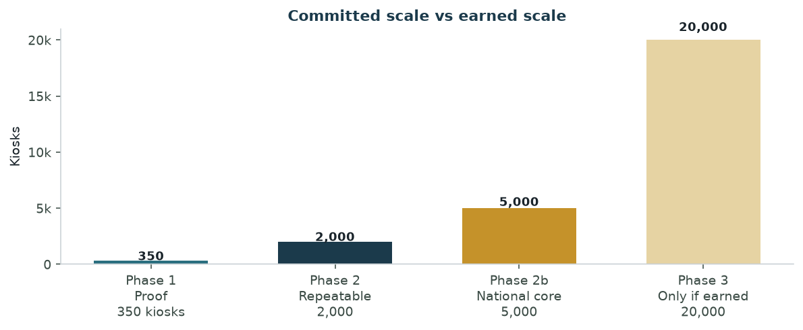
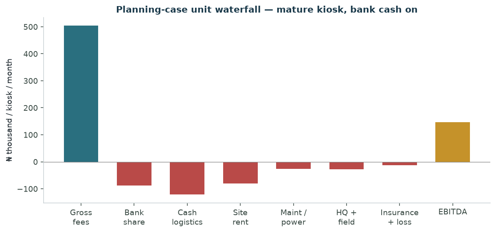
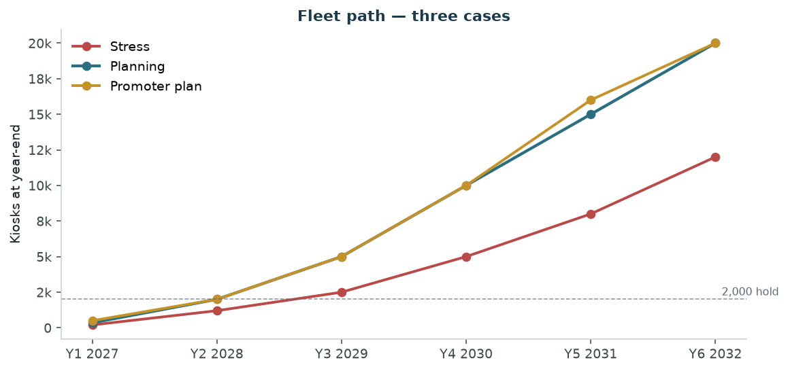
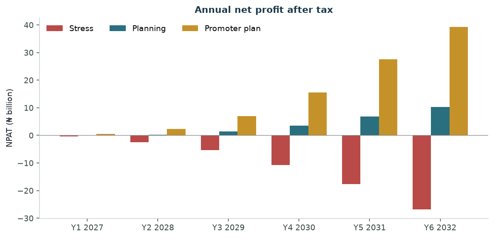
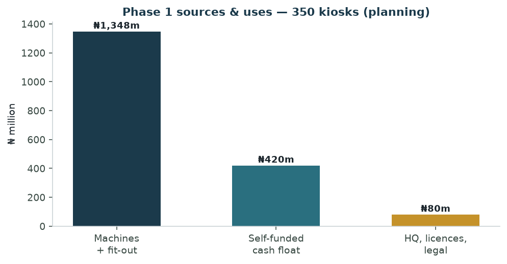
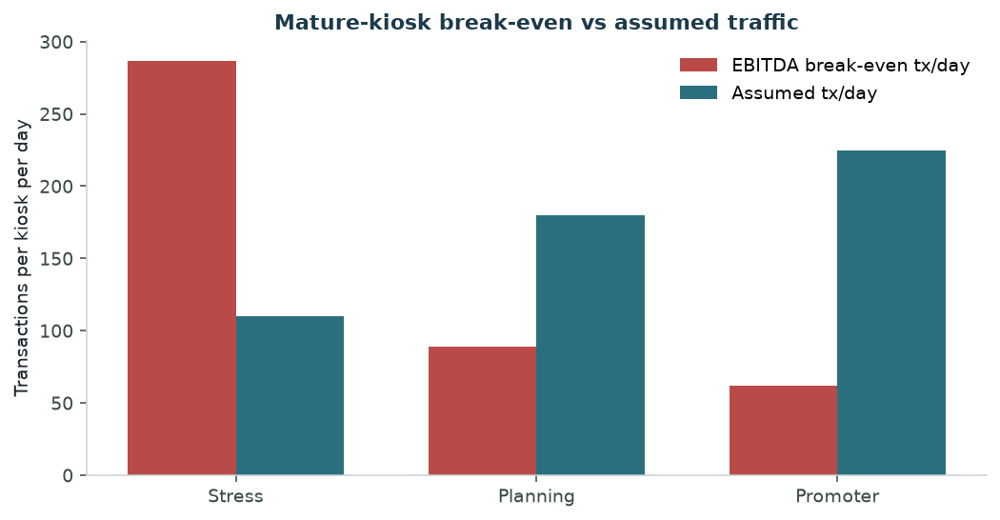
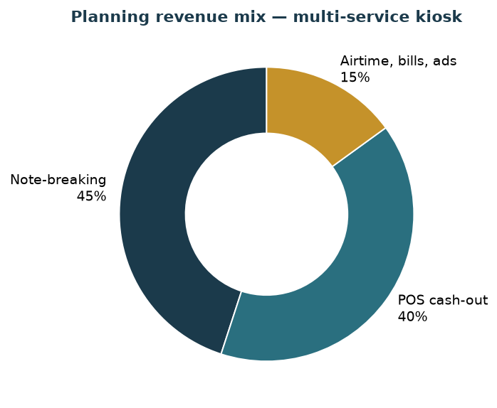
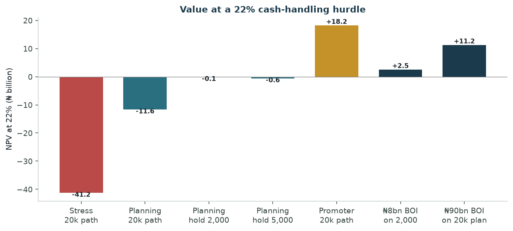
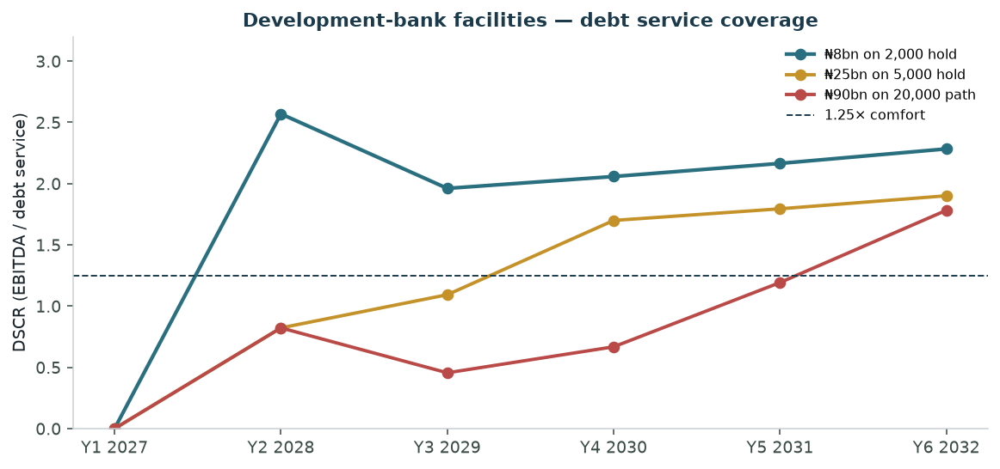

# CashEase Nigeria
# Feasibility Study

**Independent Multi-Service Cash Kiosks**  
Note-breaking · POS cash-out · Airtime and bills  
Nigeria — starting in Lagos / Ogun, then national

A study of the progressed plan: own the machines, do not sell them to banks or the CBN, partner with banks only for cash and settlement, and scale only after proven traction. The conversation’s 20,000-kiosk / ₦90 billion ambition is treated as an earned option, not a Year-1 commitment.

| Field | Detail |
| --- | --- |
| Working name | CashEase Nigeria Ltd (legal name to be confirmed) |
| Prepared | August 2026 |
| Source plan | Shared Grok conversation, 17 Feb – 22 May 2026 (change-machine thread) |
| Horizon | Year 1–Year 6 (2027–2032) |
| Currency | Nigerian naira (₦), nominal |
| Planning case | 180 tx/day, 92% uptime, ₦100 blended fee, bank cash from Year 2 |
| Classification | Confidential planning document |

**Purpose.** This study extracts the change-machine business from the source conversation, states the **progressed final plan** (what survived after the model was challenged), and tests whether that plan is feasible. It covers the operating model, ownership, market, technology, locations, cash supply, regulation, a three-case six-year financial model, the ₦90 billion development-bank question, risk, and the only scale that should be committed now.

**Disclaimer.** Figures are illustrative projections on stated assumptions. They are not guarantees. Desktop estimates from the source conversation have been haircut and stress-tested; they are not audited market research. This document is not financial, legal, tax or investment advice. Independent professional advice is required before capital is committed.

---

## Contents

1. [Executive Summary](#1-executive-summary)
2. [How the Plan Progressed](#2-how-the-plan-progressed)
3. [Business Overview & Strategic Model](#3-business-overview--strategic-model)
4. [Market Analysis](#4-market-analysis)
5. [Product, Technology & Supply](#5-product-technology--supply)
6. [Locations, Cash & Operations](#6-locations-cash--operations)
7. [Regulation, Banks & the CBN](#7-regulation-banks--the-cbn)
8. [Growth Roadmap](#8-growth-roadmap)
9. [Financial Plan](#9-financial-plan)
10. [The ₦90 Billion Question](#10-the-90-billion-question)
11. [Risk Assessment](#11-risk-assessment)
12. [Environmental, Social & Governance](#12-environmental-social--governance)
13. [Conclusion & Recommendations](#13-conclusion--recommendations)
14. [Appendices](#14-appendices)

---

## 1. Executive Summary

The progressed plan is **not** “design a Naira change machine in China and sell it to banks at ATM vestibules for a commission.” That idea was tested in February 2026 and discarded. The plan that survived by May 2026 is:

1. **Own 100% of the kiosks.** Banks do not buy the hardware. They may supply cash and settlement.
2. **Sell a bundle, not a novelty.** Each kiosk breaks notes **and** does POS cash-out, airtime, bills and (later) ads. Pure change fees do not carry the P&L.
3. **Sit in cash-heavy non-bank sites** — markets, motor parks, fuel stations, campuses — not inside bank branches.
4. **Prove 200–500 units**, then 2,000, then (only with data and a bank cash line) 5,000–20,000.
5. **Treat CBN endorsement as a signal, not a cheque.** Large money, if any, comes from the Bank of Industry (or a syndicate) after traction — and ₦90 billion is a later, staged ask, not an opening facility.

That model is the right one for Nigeria’s cash-plus-agent economy. The **numbers attached to it in the source conversation are not**. At 2,000 machines the conversation projected ₦12–24 billion annual net profit and 40–55% net margins. A full cost stack (site rent, cash logistics, bank revenue share, field staff, insurance, theft, depreciation and tax) produces planning-case net margins of about **3–10%** on the way to scale, and about ₦1.2 billion NPAT on a **held** 2,000-kiosk fleet — an order of magnitude below the desktop plan.

### Key figures at a glance — planning case

| Metric | Value |
| --- | --- |
| Recommended first commitment | **350 kiosks** (mid-point of the 200–500 proof band) |
| Opening equity | **₦1.85 billion** (₦1.35bn machines + ₦420m self-funded float + ₦80m HQ/licences) |
| Unit CapEx | ₦3.50m hardware/software + ₦0.35m site fit-out = **₦3.85m** |
| Self-funded float, Phase 1 | ₦1.20m per kiosk (banks take most of this from Year 2) |
| Assumed traffic | 180 transactions/day · 92% uptime · ₦100 blended fee |
| Gross per kiosk / month | **₦504,000** |
| EBITDA break-even (bank share on) | **89 tx/day** (51% margin of safety vs 180) |
| Phase 1 hold (350, 6 years) | IRR **11%** · NPV at 22% **−₦448m** |
| Hold at 2,000 | IRR **21%** · NPV at 22% **−₦89m** (around the hurdle) |
| Unlevered sprint to 20,000 | NPV at 22% **−₦11.6bn** — growth capex destroys value |
| ₦8bn BOI on a 2,000 hold | Equity NPV **+₦2.50bn** · min DSCR **1.96×** |
| ₦25bn BOI on a 5,000 hold | Equity NPV +₦7.35bn · min DSCR **0.82×** (too large) |
| ₦90bn BOI on the 20,000 path | Min DSCR **0.46×** — **not bankable** on planning economics |
| Promoter (Grok-plan) 20,000 path | NPV **+₦18.2bn** · IRR **85%** — only if traffic and fees hit the conversation’s “realistic” band |



*Figure: Only Phase 1 is a present commitment. 2,000 and 5,000 are the first earned scales. 20,000 is an option, not a plan.*

### Feasibility verdict

| Question | Verdict |
| --- | --- |
| Is the **model** feasible? | **Yes.** Own the assets, bundle change with POS and bills, place in non-bank cash sites, use banks for float and small notes. |
| Is **Phase 1 (≈350 kiosks)** feasible? | **Yes, as a proof engine** — if ₦1.85bn of equity is available and locations are chosen one-by-one. It does not, by itself, clear a 22% cash-handling hurdle. That is acceptable for a pilot. It is not a reason to raise ₦90bn. |
| Is **2,000 kiosks** feasible? | **Conditionally yes.** Requires Phase 1 unit economics at or above planning, a signed bank cash agreement, and either retained cash plus a **right-sized** facility (about ₦8bn, not ₦90bn) or a slower self-funded ramp. |
| Is **20,000 kiosks / ₦90bn** feasible now? | **No.** Not on planning economics, not without years of audited traction, and not as a single ticket. CBN “backing” does not substitute for repayment capacity. |
| Is the stress case feasible? | **No.** At 110 tx/day and ₦70 fees the kiosk never covers rent, logistics and bank share (break-even 286 tx/day). Weak locations kill the firm. |

**Go / no-go for capital today:** go **only** on Phase 1. Do not order 2,000 machines, do not submit a ₦90 billion BOI file, and do not frame the product as a CBN circulation programme until 6–12 months of kiosk-level data exist.

---

## 2. How the Plan Progressed

The source conversation is a single thread that begins as a tomato-farm plan and, from 17 February 2026, opens a second business: a custom Naira change machine. The change-machine idea was then challenged, narrowed and restated in May 2026. This study uses **only the version that survived**.

### 2.1 Ideas that were dropped

| Early idea (Feb 2026) | Why it was dropped |
| --- | --- |
| Sell machines to banks for ATM vestibules and take a per-transaction commission | CBN ATM rules, bank preference to own their cash network, long procurement, low share of fee |
| Sell hardware/software to the CBN as a “put money in circulation” programme | CBN is not a commercial buyer of kiosks; it does not supply cash to private operators |
| Pure note-to-coin box with no other services | Fee per change is too small unless traffic is extreme |
| Jump to 10,000–50,000 units on a CBN letter | No licence path, no float, no locations, no data |

### 2.2 The progressed final plan (May 2026)

After the questions *“best model?”*, *“own or sell?”*, *“2,000-machine P&L?”*, *“locations and CBN cash?”*, *“where do small bills come from?”*, *“then 20,000?”*, *“do I still own the machines?”* and *“can traction unlock ₦90bn?”*, the plan is:

| Element | Final position |
| --- | --- |
| Asset ownership | Promoter owns **100%** of kiosks at every scale |
| What the bank owns | The **cash float** inside the machine (once a partnership is signed), plus settlement |
| Revenue share | Target **60–75%** to CashEase / **25–40%** to the bank on *eligible* (mainly POS) flows; change fees stay with the operator |
| Product | Multi-service kiosk: note-breaking + POS + airtime/bills + optional screen ads |
| Sites | Non-bank, high-footfall, cash-heavy |
| Legal wrapper | Ltd company; PTSP and/or IAD registration; acquirer/bank agency for settlement |
| Hardware | China OEM, custom Naira validators and dispensers, remote monitoring, solar/battery |
| Cash & small notes | Through partner banks (and recycling at own sites). Not from CBN vaults. |
| Scale | Phase 1: 200–500 → Phase 2: 2,000–5,000 → Phase 3: 10,000–20,000 only after proof |
| Funding | Equity and retained profit first; BOI in **tranches** after 300–500 live kiosks; ₦90bn is a later syndicate ask, not a Day-1 loan |
| CBN role | Policy alignment, possible sandbox/recognition, **not** a lender |

The rest of this study is a feasibility test of that plan, not a reprint of the conversation’s revenue tables.

---

## 3. Business Overview & Strategic Model

### 3.1 Concept

CashEase deploys unmanned (or lightly attended) **multi-service cash kiosks** that:

- accept large Naira notes and dispense smaller notes and, where stock exists, coins;
- offer POS cash withdrawal (and, where the acquirer allows, deposit);
- sell airtime, data and bill payment;
- later, sell screen advertising and (only with a licence) adjacent services.

The customer is the cash-using public in markets and transport nodes. The economic customer is also the **partner bank**, which wants float utilisation, agent-network reach and help against CBN ATM-density pressure — without buying or maintaining the box.

### 3.2 Why owning beats selling

Selling machines or software to banks/CBN was rejected because:

- banks already have vendors and want control of ATM estate;
- IAD/ATM rules force bank settlement, PCI-grade security and interoperability anyway — so the hard work of “selling in” does not remove regulation;
- a hardware sale is a one-time margin; a owned kiosk is a daily fee stream;
- CBN does not write cheques for private kiosk fleets.

Owning keeps the asset on the balance sheet (collateral for a later facility), keeps most change and a majority of POS economics, and still allows a bank to supply cash. That is how successful independent ATM deployers and large PTSPs already work in Nigeria.

### 3.3 Value proposition

| Party | Why they use CashEase |
| --- | --- |
| Public | Faster change than a trader; cash-out without a bank queue; airtime/bills in one stop |
| Site host (market, park, fuel station) | Rent + optional 5–10% site share; less “no change” friction for their own customers |
| Partner bank | Extra acquiring volume, float turn, non-branch footprint, contribution to ATM/agent density |
| CBN (indirect) | More small-denomination circulation **if** banks actually load small notes — a policy story, not a contract |

### 3.4 Competitive advantages (if executed)

- **Bundled trip.** A change-only box loses to the man with a drawer of ₦100 notes. A box that also pays out POS cash and sells airtime wins the same queue POS agents already own.
- **Owned estate.** Locations and machines are transferable, financeable and not hostage to a single bank’s hardware RFP.
- **Denomination discipline.** The product is designed around ₦100/₦200/₦500, not vanished ₦5–₦20 coins.
- **Data.** Remote cash-level and uptime telemetry is the leverage for the bank conversation after Phase 1.

None of these advantages exist until Phase 1 is live. They are not reasons to skip the pilot.

### 3.5 SWOT

| | Helpful | Harmful |
| --- | --- | --- |
| **Internal** | Clear ownership model; bundle matches how Nigerians already use agents; China OEM path is real | Cash logistics and theft; float lock-up before a bank line; weak in-house payments licence |
| **External** | Persistent cash use; ATM-density pressure on banks; agent-banking precedent | CBN can reclassify devices; small-note scarcity; POS aggregators (Moniepoint, OPay, PalmPay) already sit in the same sites |

---

## 4. Market Analysis

### 4.1 Why a change machine exists at all

Nigeria remains a **cash-plus-digital** economy. Large notes are easy to get from ATMs and agents; small notes and coins are not. Markets, danfo/okada fares, and stall trade still require broken money. That gap is the only reason to build a specialised dispenser. It is **not** large enough, on change fees alone, to justify the CapEx.

The source conversation’s February 2026 market colour (high currency-in-circulation, strong ATM withdrawal value, tolerance for small access fees) is directionally right and should be replaced, before a BOI file, with:

- current CBN currency-in-circulation and denomination mix;
- NIBSS / acquirer volumes for POS cash-out in the target LGAs;
- a two-week **manual count** of change events at each candidate site (people asking “do you have ₦100s?”).

Until those three exist, every revenue table in this document is a scenario, not a forecast.

### 4.2 The real market is the agent-cash market

The comparable business is **not** a bank ATM. It is the POS/agent kiosk that already earns ₦150,000–₦700,000+ net in a good month in a prime spot — the benchmark the source plan used. CashEase is an attempt to **own the box** and add a change module on top of that proven demand.

Addressable demand is therefore:

- **Primary:** cash-out and change at 50–150 prime Lagos/Ogun nodes (Phase 1).
- **Secondary:** the same pattern in Abuja, Kano, Port Harcourt, Ibadan, Onitsha (Phase 2).
- **Not addressable without a licence change:** bank vestibules, “CBN-mandated” placement, or coin-only public service.

### 4.3 Pricing power

Nigerians already pay ATM surcharges and agent fees. A ₦20–₦100 change fee and a ₦50–₦200 POS fee are in-market **if** the alternative is a 20-minute hunt for change. Pricing power dies if:

- the machine is empty of small notes (the core operational risk);
- a human agent next door is cheaper and talking;
- the site is a mall with working ATMs and card-accepting shops.

### 4.4 Competition

| Competitor | What they already do | Implication |
| --- | --- | --- |
| Moniepoint, OPay, PalmPay, bank agents | POS cash-out, deposits, bills, in the same markets | CashEase must **partner or differentiate** (change module + owned hardware), not out-agent them on brand |
| Informal changers | Instant, flexible, sometimes better small-note stock | Compete on safety, hours and reliability — not on warmth |
| Bank ATMs | Cash-out of larger notes; poor small-note mix | Adjacent, not the same job; vestibule placement remains unlikely |
| Future bank or fintech kiosks | Anyone can add a recycler | Speed of Phase 1 data and site leases is the moat, not the OEM drawing |

### 4.5 Africa expansion

The February thread asked about Ghana, Kenya and South Africa. **Out of scope for this study.** Currency homologation, local cash-in-transit and a second central-bank relationship are a Phase 3-after-Nigeria problem. Mentioning them in a Phase 1 information memorandum would weaken, not help, a BOI conversation.

---

## 5. Product, Technology & Supply

### 5.1 Machine specification (minimum viable)

| Function | Requirement |
| --- | --- |
| Accept | ₦200, ₦500, ₦1,000 (and ₦100 if validator supports it) with UV/MG/IR counterfeit checks |
| Dispense | ₦50 / ₦100 / ₦200 / ₦500 cassettes; coin hopper **optional** (do not depend on coins) |
| POS | Certified PED / Android POS or integrated acquiring app via a licensed acquirer |
| Power | Solar + battery sized for 12–16 hour market days; generator only as site backup |
| Security | Safe, shock/tilt sensors, cameras, GPS, remote inhibit, limited cassette value |
| Software | Naira denomination maps, remote cassette levels, lockout, reconciliation file, bilingual UI |
| Uptime target | 95% (planning models 92%) |

Unit cost used in the planning case: **₦3.5 million** landed, configured and with Naira software, plus **₦0.35 million** site fit-out (plinth, cage or shopfront, branding, solar). Stress uses ₦4.5m + ₦0.45m. Promoter uses ₦3.0m + ₦0.30m.

### 5.2 China OEM path

The source plan’s OEM route is technically sound. Chinese firms already ship bill validators, hoppers and kiosks into Africa. The feasibility issues are not “can China build it?” They are:

- **Naira note updates.** New series or substrate changes brick unpatched validators. Contract for firmware SLAs and a local spare pool.
- **Lead time.** Budget 12–16 weeks order-to-Lagos for the first 50, then a rolling 8–10 week cadence. Do not pay for 350 units before 10 units survive a 60-day site trial.
- **Spare parts and skilled techs.** A 350-unit fleet needs a Lagos workshop and a parts kit per 20 machines. This is in the field-staff line, not in the Alibaba quote.
- **FX.** Machines are a dollar (or RMB) cost. A 20–30% naira slide between order and landing is in the stress unit CapEx, not as a separate hedge P&L.

**Procurement rule:** 5–10 prototype units → 30–50 pilot → only then the balance of Phase 1. The conversation’s “commission 5–10 then pilot” step is retained as a hard gate.

### 5.3 Software and the “sell the stack to CBN” temptation

Custom software is required for denominations, telemetry and reconciliation. It is **not** a second business in Phase 1. Licensing the stack to banks or the CBN is a Year 4 option once 2,000 machines have produced a year of clean logs. Building a sales motion for that option now would recreate the discarded model.

---

## 6. Locations, Cash & Operations

### 6.1 Location is the business

The source plan is correct: **location quality dominates software quality.** The planning case assumes 180 paid transactions per up day. The stress case (110 tx/day, ₦70 fee, ₦120k rent) never breaks even. That is a location result, not a China-OEM result.

**Phase 1 site list (types, not addresses):**

- Wholesale and retail markets (Mile 12, Oshodi, Tejuosho, Balogun-type nodes)
- Motor parks and last-mile junctions
- Busy fuel stations on market corridors
- Campus gates
- Hospital and large-church/mosque approaches *only* if a weekday count supports it

**How a site is won (from the progressed plan, kept):**

1. Count traffic at three day-parts for two weeks. Record existing POS/ATM and “change” events.
2. Offer the host a written lease: ₦50k–₦200k/month plus optional 5–10% of *site-attributable* net, with a 3-month performance guarantee in the host’s favour.
3. Use market associations / park leadership; register with the LGA; budget “area” risk explicitly rather than pretending it is zero.
4. Fix the terminal to the geotag the CBN now expects for POS.
5. Sign 12–36 month occupancy with relocation rights.

Budget **₦100k–₦300k** per prime site for deposit and first fit-out beyond the ₦0.35m unit setup. Phase 1 should not open the 50th site until the first 10 have four weeks of data.



*Figure: On planning fees, a mature kiosk still has a thick logistics and rent stack. There is no 50% net margin after that stack.*

### 6.2 Cash float and small bills

This is the operational heart of a change business and the point the May conversation got right.

**CBN will not load the machines.** Only banks and licensed CIT companies draw from CBN depots. CashEase’s path is:

1. **Phase 1:** self-fund **₦1.2 million** per kiosk, weighted to ₦100/₦200/₦500. Recycle small notes taken in at the same sites.
2. **From Year 2:** a partner bank supplies most of the float. Planning assumes CashEase still funds 35% of float at 2,000 units, falling to 15% at 20,000.
3. **Request mix** on every replenishment: e.g. 40% ₦100/₦200, 30% ₦50 if available, rest ₦500. Write this as an SLA, not a hope.
4. **Do not design the product around coins or ₦5–₦20 notes.** They are scarce. Dispense what the bank can actually deliver.
5. **Respect agent cash-out caps** (the conversation cited ~₦1.2m/day-class limits). Cassette limits and daily CIT cadence must match the rule in force, not the model’s average.

At 2,000 machines a ₦1.2m float is **₦2.4 billion** of cash in the field. That is why the ownership table in §3 matters: if the bank owns the float, CashEase does not lock ₦2.4bn of equity in notes.

### 6.3 Operating cadence

| Rhythm | Action |
| --- | --- |
| Continuous | Telemetry on cassette levels, jams, power, GPS |
| Daily | Exception CIT for empty/full cassettes; reconcile; AML flags |
| Weekly | Planned CIT; denomination rebalance; host check-in |
| Monthly | Site P&L; kill or relocate the bottom decile; insurance declarations |
| Quarterly | OEM parts review; acquirer fee review; CBN circular check |

Field staffing in the model: **one technician per 40 kiosks**, **one monitor per 80**, plus a growing HQ. That is lean. A theft wave or a bad OEM batch will require more.

### 6.4 Security

Cash machines in Nigeria are stolen, burned and skimmed. The planning case puts **1.2% of gross** in theft/loss and **1.6% of machine+float value** in insurance. Stress uses 3.5% and 2.2%. Mitigations that must be in the opex, not the appendix:

- cassette value caps and time locks;
- CIT, not staff cars, above a set threshold;
- insurance that actually pays on theft in markets (read the exclusions);
- the right to **pull a site in 72 hours** if the host cannot keep the approach safe.

---

## 7. Regulation, Banks & the CBN

### 7.1 What CashEase is — and must not become too early

| Classification | When it applies | Phase 1 stance |
| --- | --- | --- |
| Ordinary kiosk + POS via a licensed acquirer | Change box + agent-style POS | **Start here** |
| PTSP | Operating payment terminals as a service | File as soon as the fleet is more than a handful of “partner” terminals |
| IAD (Independent ATM Deployer) | If the box is an ATM in CBN’s eyes | Only if product scope requires it; heavier cash and scheme rules |
| Full bank / MFB | Taking deposits as principal | **Out of scope** |

The progressed plan’s instruction stands: **avoid full ATM classification for as long as the product is honestly a kiosk + POS.** The moment cash-out is scheme-card ATM withdrawal, IAD + bank settlement is mandatory. Counsel should classify the intended transaction set *before* the OEM is paid for 350 units.

### 7.2 Bank partnership (the only realistic “CBN cash” path)

Direct CBN cash is not available. The workable structure, from the May plan and standard IAD/PTSP practice:

| Aspect | Who |
| --- | --- |
| Kiosk hardware | CashEase — 100% |
| Brand and site lease | CashEase (optional co-brand) |
| Cash inside the cassettes | Partner bank, once the agreement is live |
| Settlement | Bank / NIBSS |
| Change fees | CashEase (subject to any agreed site share) |
| POS / acquiring fees | Split; target 60–75% CashEase |
| Relocation / removal | CashEase after notice |

**Negotiate in writing:** ownership remains with CashEase; minimum replenishment cadence and denomination mix; 3–5 year term; 70%+ operator share as the opening ask; exit if cash SLAs fail.

A sample proposal (conversation text, edited) is in [Appendix B](#b-sample-bank-partnership-proposal).

### 7.3 What “CBN backing” can and cannot do

The last question in the source thread was whether CBN backing is “enough” for ₦90 billion. The answer used here:

- CBN can **recognise**, sandbox, or write policy that makes banks more willing to load small notes and sign IADs.
- CBN can **convene** blended finance. It does not lend ₦90 billion to a private kiosk company.
- A supportive letter **helps a BOI file**. It does not replace audited volume, collateral and DSCR.

Pitching the product as “putting money in circulation” is a **policy narrative for banks and BOI**, not a revenue line.

---

## 8. Growth Roadmap



*Figure: Planning follows the conversation’s 350 → 2,000 → 5,000 → 10,000 → 15,000 → 20,000 shape. Stress grows slower and still loses money. Promoter starts at 500 and reaches 20,000 in Year 6.*

### 8.1 Phases (planning calendar)

| Phase | When | Fleet (year-end) | Purpose | Gate to the next phase |
| --- | --- | --- | --- | --- |
| **0 — Prototypes** | Months 0–4 | 5–10 | OEM and Naira firmware live in one workshop and two sites | 60-day uptime ≥ 90%; no unfixable validator failure |
| **1 — Proof** | Y1 (2027) | **350** | Location machine, self-funded float, first acquirer | ≥ 150 tx/day median; theft < 2% of gross; 6 months of books |
| **2 — Repeatable** | Y2 (2028) | **2,000** | First bank cash line; Lagos–Ogun–Ibadan density | Bank SLA live; Phase 1 unit EBITDA ≥ planning; DSCR math for any facility |
| **2b — National core** | Y3 (2029) | **5,000** | Abuja, Kano, PH, Onitsha | Two banks or one bank + CIT; no regulatory reclassification shock |
| **3 — Option** | Y4–Y6 | 10,000–20,000 | Only if planning unit economics have **beaten** the model for 4 quarters | BOI/syndicate sized to DSCR ≥ 1.25×, not to a ₦90bn headline |

The conversation’s Phase 3 (10,000 → 20,000, possible NGX listing, “₦120–250 billion net profit”) is recorded as **promoter ambition**. It is not in the recommended commitment.

### 8.2 Implementation timeline — Phase 1

| Window | Work |
| --- | --- |
| Months 0–2 | Incorporate; counsel opinion on kiosk vs ATM; acquirer term sheet; OEM shortlist; 30-site longlist |
| Months 2–4 | 5–10 units land; workshop; two live sites; insurance bind |
| Months 4–8 | 30–50 unit pilot; first 15 leases; PTSP/acquirer filings |
| Months 8–12 | Scale to 350 only if pilot medians hold; start bank conversations with *data*, not decks |
| Year 2 H1 | Bank cash agreement; order the Phase 2 batch against that agreement, not before |

### 8.3 What must not happen

- Ordering 2,000 machines on the back of a China quotation.
- Signing 200 site “promises” without two-week counts.
- Submitting a ₦90bn BOI application from a spreadsheet and a Grok link.
- Expanding to Ghana/Kenya to make the story larger.

---

## 9. Financial Plan

Three unlevered cases share the same accounting (30% CIT + 3% education tax on PBT, five-year straight-line on machines and fit-out, 22% discount rate for cash-handling risk). They differ in traffic, fees, costs and how fast the fleet is pushed.

| Assumption | Stress | Planning | Promoter (Grok “realistic”) |
| --- | --- | --- | --- |
| Year-end fleet Y1→Y6 | 200–1,200–2,500–5,000–8,000–12,000 | 350–2,000–5,000–10,000–15,000–20,000 | 500–2,000–5,000–10,000–16,000–20,000 |
| Tx / up day | 110 | 180 | 225 |
| Uptime | 85% | 92% | 93% |
| Blended fee | ₦70 | ₦100 | ₦115 |
| Gross / kiosk / month | ₦199k | **₦504k** | ₦732k |
| Bank share (from Y2) | 38% of 70% of gross | 32% of 55% of gross | 30% of 50% of gross |
| Logistics | 32% of gross | 24% | 22% |
| Site rent / month | ₦120k | ₦80k | ₦70k |
| Unit CapEx (hw + fit-out) | ₦4.95m | ₦3.85m | ₦3.30m |
| Theft / loss | 3.5% of gross | 1.2% | 0.8% |

Promoter is the conversation’s mid “realistic” band (roughly 200–250 tx/day and ₦80–150 fees, 2,000-then-20,000 scale). Planning is a feasibility haircut. Stress is what happens if sites are mediocre and small notes stay expensive.



*Figure: Stress is value-destroying at every scale. Planning becomes profitable but not ₦12–24bn-at-2,000-machines profitable. Promoter is the only case that looks like the source deck.*

### 9.1 Phase 1 sources and uses (planning)

| Use | ₦ |
| --- | --- |
| 350 × ₦3.85m machines and fit-out | 1.35 billion |
| 350 × ₦1.20m self-funded float | 420 million |
| HQ, licences, legal, first insurance | 80 million |
| **Total opening equity** | **1.85 billion** |



Fund this with **equity** (promoter, angels, a small strategic). Do not open a BOI file for Phase 1. A development bank will ask for the data Phase 1 is meant to produce.

### 9.2 Unit economics and break-even



| | Stress | Planning | Promoter |
| --- | --- | --- | --- |
| EBITDA break-even (tx/day, bank share on) | **286** | **89** | **62** |
| Assumed tx/day | 110 | 180 | 225 |
| Margin of safety | **−160%** | **+51%** | **+72%** |

Planning has a real cushion — **if** 180 transactions happen. Stress has no cushion at all. Site selection is a binary risk, not a 10% sensitivity.



*Figure: Planning mix used for narrative and bank-share design — about 45% note-breaking, 40% POS, 15% airtime/bills/ads. Change is the differentiator; POS is the volume engine.*

### 9.3 Six-year unlevered P&L (planning — 20,000 path)

| Year | Fleet (end) | Gross | EBITDA | NPAT | FCF | NPAT margin |
| --- | --- | --- | --- | --- | --- | --- |
| Y1 2027 | 350 | ₦1.06bn | ₦0.35bn | ₦0.05bn | ₦0.32bn | 5.0% |
| Y2 2028 | 2,000 | ₦7.10bn | ₦1.85bn | ₦0.21bn | **−₦5.02bn** | 3.0% |
| Y3 2029 | 5,000 | ₦21.16bn | ₦5.88bn | ₦1.38bn | **−₦6.98bn** | 6.5% |
| Y4 2030 | 10,000 | ₦45.33bn | ₦12.83bn | ₦3.48bn | **−₦8.97bn** | 7.7% |
| Y5 2031 | 15,000 | ₦75.56bn | ₦21.64bn | ₦6.85bn | −₦1.15bn | 9.1% |
| Y6 2032 | 20,000 | ₦105.78bn | ₦30.45bn | ₦10.22bn | ₦5.47bn | 9.7% |

Y2–Y5 free cash flow is negative because **machines are being bought faster than they earn**. That is why an unlevered 20,000 sprint has a **−₦11.6 billion** NPV at 22% even though Year 6 NPAT is ₦10bn. Scale is not the same as value.

### 9.4 The conversation’s 2,000-machine table versus this model

| Item | Source plan (May 2026, “realistic”) | This study, planning, **held at 2,000** |
| --- | --- | --- |
| Opening capital for 2,000 | ₦7.5–11.5bn (all at once) | ₦1.85bn for 350, then ~₦6.4bn incremental in Y2 |
| Annual gross at 2,000 | ₦17–43bn | ~₦12.1bn run-rate (2,000 × ₦504k × 12) |
| Annual net | **₦12–24bn** (40–55% margin) | **~₦1.2bn NPAT** (Y3–Y6 hold) |
| Break-even on a batch | 4–8 months per machine (stated) | Phase 1 IRR 11%; 2,000-hold IRR 21% |

The gap is not a rounding error. The source table under-weights rent, CIT, bank share, depreciation and tax, and treats peak-site months as fleet averages. **Do not raise or lend against the ₦12–24bn figure.**

### 9.5 Hold cases — the scales that can be discussed with a lender

| Path | 6-year IRR | NPV @ 22% | What it means |
| --- | --- | --- | --- |
| Hold 350 | 11.1% | −₦448m | Proof engine. Does not clear a cash-handling hurdle. Still the correct first step. |
| Hold 2,000 | 21.2% | −₦89m | First scale that is *near* the hurdle. The real Phase 2 target. |
| Hold 5,000 | 19.1% | −₦571m | More machines, more growth capex; slightly worse than holding 2,000 unless fees beat plan. |
| Sprint 20,000 unlevered | n/m (−43%) | −₦11.6bn | Do not do this on equity alone. |
| Promoter sprint 20,000 | 84.5% | +₦18.2bn | Only if 225 tx/day and ₦115 fees are actually delivered fleet-wide. |



*Figure: Value appears when growth is paced or when cheap, right-sized debt funds a 2,000-kiosk hold. A ₦90bn facility on the 20,000 path inflates equity NPV only by stuffing the firm with cash it cannot service (see §10).*

### 9.6 Promoter case (for the record)

If the fleet actually does 225 tx/day at ₦115 and costs stay at the conversation’s leaner band, Year 6 NPAT is **₦39.3bn** on ₦158bn gross (25% net margin) and unlevered NPV is **+₦18.2bn**. That is a legitimate *upside* case. It is not the case a credit committee should underwrite, and it is still far below the conversation’s ₦120–250bn net at 20,000 machines.

---

## 10. The ₦90 Billion Question

The last move in the source plan was: *with proven traction, can we get ₦90 billion from a development bank, or is CBN backing enough?*

### 10.1 Institutional answer

| Institution | Role | ₦90bn? |
| --- | --- | --- |
| **CBN** | Regulator, possible sandbox/recognition, policy on denominations and IADs | **No.** Not a commercial lender to this company. |
| **Bank of Industry** | Most relevant DFI for manufacturing + digital infrastructure; large-enterprise window, single-digit-class rates, 7–10 year tenors | **Possibly in tranches**, after 300–500 live kiosks, audited numbers, bank cash agreements and collateral. ₦90bn as one private-ticket is high. |
| **Development Bank of Nigeria** | On-lends through PFIs to MSMEs | Unlikely as a ₦90bn direct |
| Commercial banks | Co-lenders, cash-supply partners, account relationship | Needed in any syndicate |

The conversation’s own probability band is retained as colour, not as a forecast: even with excellent traction, a 40–60% chance of **staged** ₦90bn-class money; much less with only a pilot.

### 10.2 What the debt can actually bear (planning economics)

Facilities are modelled at 9% interest, drawings as shown, amortisation from Year 3, leftover principal after Year 6 still on the books.

| Facility | Against | Equity NPV @ 22% | Minimum DSCR | Year-6 debt left | Credit read |
| --- | --- | --- | --- | --- | --- |
| **₦8bn** in Y2 | Hold at **2,000** | **+₦2.50bn** | **1.96×** | ₦4.0bn | **Right-sized** for Phase 2 |
| ₦25bn in Y2 | Hold at 5,000 | +₦7.35bn | **0.82×** | ₦12.5bn | Too big — coverage breaks in Y2 |
| ₦15bn + ₦15bn | Hold at 5,000 | +₦7.94bn | 0.91× | ₦15.0bn | Still tight |
| **₦90bn** (25+35+30) | Sprint to 20,000 | +₦11.25bn | **0.46×** | ₦47.1bn | **Not bankable** |
| ₦90bn on promoter traffic | Sprint to 20,000 | +₦42.4bn | 1.06× | — | Barely 1× — still not a comfortable DFI credit |



*Figure: Only the ₦8 billion facility on a 2,000-kiosk hold clears a 1.25× comfort line on planning economics. ₦90 billion does not.*

### 10.3 Recommended funding sequence (replaces the ₦90bn headline)

1. **Equity ₦1.85bn** — Phase 1, 350 kiosks.
2. **After 6–12 months of books** — BOI (or a bank club) **₦8–12 billion** to fund the step to 2,000, with machines as collateral and the cash-supply bank in the room.
3. **After four clean quarters at 2,000** — a second tranche (₦15–25bn class) only if unit traffic is at or above planning **and** DSCR stays ≥ 1.25× on the combined debt.
4. **₦90bn** — only as a **later syndicate** (BOI + commercial banks + possible DFI) once 5,000 kiosks exist, not as the first conversation.

This is the same sequence the source plan eventually recommended (“₦20–30 billion first, then scale”) — tightened, because ₦25bn already strains a 5,000-kiosk planning P&L.

---

## 11. Risk Assessment

| Risk | Likelihood | Impact | Mitigation |
| --- | --- | --- | --- |
| Weak sites (stress economics) | High if rushed | Fatal | Two-week counts; kill bottom decile monthly; cap Phase 1 at 350 |
| Small-note scarcity | High | High | Bank SLA on mix; design around ₦100–₦500; recycle; never promise coins |
| Theft / vandalism | High | High | Caps, CIT, insurance with market-theft wording, 72-hour pull right |
| CBN reclassifies kiosk as ATM | Medium | High | Counsel opinion before OEM scale; IAD readiness file; no scheme-ATM claims in marketing |
| Acquirer or bank walks | Medium | High | Two acquirers by 500 kiosks; contract cash SLAs with penalties |
| FX on OEM batches | High | Medium | Quote in USD/RMB; hold 20% FX buffer; no 2,000-unit PO before Phase 1 data |
| POS giants copy the change module | Medium | Medium | Speed on leases and telemetry; exclusive site clauses where legal |
| Over-raising / over-ordering | High (given the ₦90bn story) | Fatal | Board resolution: no facility > 1.5× next-24-month capex; no 20k plan in the IM |
| Digital payments reduce cash-out | Medium (slow) | Medium | Bundle bills/airtime; do not build a 20-year cash-only thesis |
| Counterfeit intake | Medium | Medium | Validator grade; cassette quarantine; staff/CIT dual control |

**Overall:** the model fails from **locations and cash logistics**, not from an inability to source a kiosk in Guangdong. The second-largest failure mode is **raising like a 20,000-kiosk utility before owning 350 working boxes**.

---

## 12. Environmental, Social & Governance

### 12.1 Environmental

- Solar-first kiosks cut diesel at the site; CIT vans are the larger footprint — route density in Lagos/Ogun first.
- End-of-life validators and batteries need an OEM take-back clause (e-waste).
- No claim is made that this is a green project for DFI “climate” windows; do not dress it as one.

### 12.2 Social

- Genuine inclusion story: small-note access in markets that banks underserve.
- Jobs: technicians, monitors, CIT escorts, HQ — material at 2,000 units, not at 10 prototypes.
- Site-host income (rent) is part of the licence to operate in markets.
- AML/CFT on POS and any cash-in must be real: thresholds, device geotag, watchlist screening via the acquirer.

### 12.3 Governance

- Single-purpose Ltd; reserved matters on debt above ₦2bn, OEM POs above 50 units, and any CBN/IAD classification change.
- Monthly kiosk P&L to the board; related-party CIT or site leases disclosed.
- External audit from Year 1 (BOI will require it anyway).
- Promoter machines are company assets — no informal “I own some, the company owns some.”

---

## 13. Conclusion & Recommendations

### 13.1 Feasibility verdict

The **progressed final plan is a feasible business model** and an **infeasible instant empire**.

Owning multi-service kiosks, placing them in cash-heavy non-bank sites, and using banks for float and small notes is consistent with how Nigerian agent cash already works. Phase 1 at **350 kiosks for ₦1.85 billion** is a rational proof. A hold at **2,000**, funded with a **right-sized (~₦8 billion)** development-bank or club facility after traction, is the first scale that can be discussed as a credit.

A **20,000-kiosk, ₦90 billion, CBN-backed national grid** is not feasible on the information in the source conversation, and it is not feasible on the planning case in this study. CBN backing is not a substitute for DSCR. The conversation’s ₦12–24 billion net at 2,000 machines should not appear in any lender file.

### 13.2 Critical success factors

1. Site counts before leases.
2. 5–10 OEM units before 350.
3. Bank cash and small-note SLA before the 2,000-unit order.
4. Counsel on kiosk-versus-ATM before marketing “ATM replacement.”
5. Facility size tied to next-two-year capex and 1.25× DSCR, not to a ₦90bn story.
6. Monthly willingness to close bad sites.

### 13.3 Recommendations

| # | Action | Owner | Timing |
| --- | --- | --- | --- |
| 1 | Incorporate, open the audit file, commission a written regulatory memo (kiosk vs ATM vs IAD) | Promoter + counsel | Month 0–1 |
| 2 | Shortlist two China OEMs; order **10** units only | Promoter | Month 1–2 |
| 3 | Two-week counts on 40 sites; sign ≤ 15 leases | Operations | Month 1–3 |
| 4 | Acquirer term sheet (POS, geotag, settlement) | Promoter | Month 2 |
| 5 | Run 10 units for 60 days; kill the OEM if validators fail Naira | Operations | Month 4–6 |
| 6 | If medians ≥ 150 tx/day, raise/deploy the balance of **350** (₦1.85bn total uses) | Board | Month 6–12 |
| 7 | Bank partnership process using **live** volumes (Appendix B) | Promoter | Month 9–15 |
| 8 | BOI/club file for **₦8–12bn**, 2,000-kiosk hold, machines as collateral — not ₦90bn | Finance | After 6–12 months of audited Phase 1 |
| 9 | Revisit 5,000 and any ₦20–30bn second tranche only after four quarters at plan | Board | Year 3 |
| 10 | Park Africa, textiles, cargo-airline and “sell software to CBN” as separate memos | Promoter | Now |

### 13.4 Final statement

CashEase is feasible as a **Nigerian multi-service cash-kiosk operator that owns its boxes and rents its float from banks**. It is not feasible as a CBN circulation franchise or as a 20,000-unit raise on a conversation draft. Build 350, measure, then borrow for 2,000. Everything after that has to be earned.

---

## 14. Appendices

### A. Glossary

| Term | Meaning in this study |
| --- | --- |
| **Change / note-breaking** | Accepting a larger Naira note and dispensing smaller notes (and coins if stocked) |
| **CIT** | Cash-in-transit |
| **DSCR** | Debt service coverage ratio — EBITDA / (interest + principal) |
| **IAD** | Independent ATM Deployer (CBN regime) |
| **NIBSS** | Nigeria Inter-Bank Settlement System |
| **NPAT** | Net profit after tax |
| **PTSP** | Payment Terminal Service Provider |
| **Promoter case** | Midpoint of the source conversation’s “realistic” traffic and fee band |
| **Planning case** | Feasibility haircut used for go / no-go |
| **Stress case** | Weak sites, expensive float, high theft |

### B. Sample bank partnership proposal

*Adapted from the progressed plan (May 2026). Replace brackets. Do not send until Phase 1 data exist.*

**To:** Agency Banking / Digital Channels, [Bank]  
**From:** CashEase Nigeria Ltd  
**Re:** Agency partnership — cash provisioning and settlement for multi-service kiosks

**Ask.** A formal agency agreement under which the bank supplies mixed-denomination cash (including ₦50/₦100/₦200 as available) and NIBSS settlement for an initial **[300–500]** CashEase-owned kiosks in Lagos and Ogun, scaling to **2,000** within 18 months if SLAs hold.

**What we own.** All kiosks, site leases and brand. Ownership remains with CashEase on removal or expiry.

**What we need from the bank.** Cassette cash, denomination mix SLA, settlement, and a compliance channel. We deploy, maintain, insure and geotag.

**Economics (opening ask).** 60–75% of eligible POS/acquiring economics to CashEase; change fees to CashEase; site rent on us. Co-brand optional.

**Why it helps the bank.** Non-branch cash footprint, float turn, volume, and a contribution to density expectations without the bank buying the hardware.

**Attachments (when live).** 13-week kiosk P&L, uptime, fraud/theft, denomination shortages, machine specs, insurance binders, CAC/KYC, counsel memo on device classification.

### C. BOI file outline (after Phase 1)

Use this only with **300–500 live kiosks** and an audit.

1. Sponsor, ownership, reserved matters  
2. Regulatory memo and licences in force  
3. Bank cash agreement (signed or near-final)  
4. Fleet register and asset valuations (collateral)  
5. 12-month audited/management accounts and kiosk cohort P&L  
6. Use of proceeds: machines, fit-out, residual self-float — **no** 20,000-unit PO  
7. Base, downside and covenant case (this model’s planning / stress / hold-at-2,000)  
8. DSCR, collateral cover, insurance  
9. Jobs and inclusion metrics (sites in underserved markets)  
10. Requested ticket: **₦8–12 billion**, 7–10 years, not ₦90 billion  

### D. Model files

| File | Role |
| --- | --- |
| `model/financial_model.py` | Six-year three-case model, hold cases, BOI overlays, break-even |
| `model/generate_charts.py` | Figures in `charts/` |
| `model/outputs/model_results.json` | Full numeric dump |
| `model/outputs/*_annual.csv` | Stress / planning / promoter annual extracts |

```bash
python3 model/financial_model.py
python3 model/generate_charts.py
```

Discount rate 22%. Tax 32.1% of PBT. Fleet paths and unit assumptions are in `SCENARIOS` inside `financial_model.py`.

### E. Source conversation — change-machine map

Public share: [grok.com/share/…](https://grok.com/share/bGVnYWN5LWNvcHk_eedde41e-2562-4867-a011-9e9fca291d33)  
Conversation id `a565b656-f2ff-4d66-8b0b-e1cedc5a6505`.

| Date | Turn | What was decided |
| --- | --- | --- |
| 17 Feb 2026 | First change-machine prompt | China OEM + bank ATM commission vs independent — independent preferred |
| 17 Feb 2026 | CBN “circulation” revenue | Large numbers if CBN backs; treated here as narrative, not a contract |
| 17 Feb 2026 | Africa | Deferred; out of scope for this study |
| 3 May 2026 | Best model | **Independent multi-service kiosk** named as the winner |
| 3 May 2026 | Own vs sell | **Own and operate**; sell-to-CBN/banks is secondary and later |
| 3 May 2026 | 2,000-machine P&L | Source ₦7.5–11.5bn capex, ₦17–43bn gross, ₦12–24bn net — **haircut in §9** |
| 3 May 2026 | Locations + CBN cash | Prime non-bank sites; CBN cash only via banks |
| 3 May 2026 | Small bills | Partner banks first; recycle; no direct CBN vault |
| 3 May 2026 | 20,000 expansion | Phased 2026–2032; ₦80–140bn total capital in the source — **option only** |
| 3 May 2026 | Ownership | Machines remain 100% promoter/company; bank owns float |
| 22 May 2026 | ₦90bn / CBN enough? | BOI in tranches after 300–500 kiosks; CBN not enough — **this study’s §10** |

### F. Document control

| Version | Date | Notes |
| --- | --- | --- |
| 1.0 | 17 Aug 2026 | First feasibility study from the progressed Grok plan; three-case model and BOI DSCR |

**Next refresh triggers:** counsel memo received; 60-day OEM trial closed; first 15-site counts complete; any CBN circular on IADs, agent cash caps or POS geotagging.
