# SNLB Farms
# Comprehensive Feasibility Study

**Commercial Tomato Farming on a Leased 100-Hectare Master Block**  
Ogun State, Nigeria — supplying Mile 12 International Market, Lagos

A self-funding expansion from 1 hectare to 100 hectares, driven by two-cycle annual production, disciplined 50/50 profit reinvestment, progressive mechanization, and a complete cost, CapEx and tax stack sized for promoters and, if later required, lenders.

| Field | Detail |
| --- | --- |
| Entity | **SNLB ENTERPRISE** (CAC BN **6922259**, 31 March 2023) trading as SNLB Farms — convert to **SNLB Farms Limited** (§2.1) |
| Prepared | August 2026 |
| Horizon | Year 1–Year 5 (build-out in six cycles / three years; steady state Years 4–5) |
| Currency | Nigerian naira (₦), nominal |
| Planning case | Regular first at non-glut Mile 12 prices — 20/18 t/ha, ₦33,000 / ₦145,000 baskets, full stack, NTA 2025 tax |
| Classification | Confidential planning document |

**Purpose.** This study assesses the commercial viability of phased hybrid tomato production on a contiguous 100-hectare master block in Ogun State, with produce sold into Mile 12 International Market (≈1.5 hours). It sets out the legal vehicle (SNLB ENTERPRISE BN 6922259 and conversion to SNLB Farms Limited), the operating model, market, agronomy, Cycle 1 calendar and cash waterfall, the ₦8 million opening uses at current shop tickets, quality spec, power and security, procurement lead times, offtake heads of terms, buffer use, expansion path, three financial scenarios, charts, discounted cash flow, optional facility terms, risk, ESG, and the conditions for first planting.

**Disclaimer.** Figures are illustrative projections on stated assumptions. They are not guarantees. This document is not financial, legal, tax or investment advice. Independent professional advice is required before capital is committed.

---

## Contents

1. [Executive Summary](#1-executive-summary)
2. [Business Overview & Strategic Model](#2-business-overview--strategic-model) — including **§2.1** legal entity (BN 6922259 → SNLB Farms Limited)
3. [Market Analysis](#3-market-analysis)
4. [Site, Agronomy & Operations](#4-site-agronomy--operations)
5. [Growth & Expansion Roadmap](#5-growth--expansion-roadmap)
6. [Financial Plan](#6-financial-plan)
7. [Risk Assessment](#7-risk-assessment)
8. [Environmental, Social & Governance](#8-environmental-social--governance)
9. [Conclusion](#9-conclusion)
10. [Appendices](#10-appendices)

Intended farm-management partner: **FarmPark** (King’s Deck, Chevron Drive, Lekki) — remaining gaps in Appendix F. Engagement is advisory on SNLB’s land; this is not a FarmPark co-investment. Cycle 1 opening uses (₦8.0 million at August 2026 shop tickets) are in §6.11.

---

## 1. Executive Summary

This study assesses a phased tomato farming venture established on a single leased hectare within a contiguous **100-hectare master block** in Ogun State, Nigeria. The vehicle on file is **SNLB ENTERPRISE** (CAC BN **6922259**). The plan incorporates **SNLB Farms Limited** for the lease, FarmPark letter and any credit file (§2.1). Produce is transported roughly **1.5 hours** to Mile 12 International Market in Lagos — West Africa’s largest fresh-produce terminal.

The operating model runs **two production cycles per year** on every hectare under cultivation:

- **Regular Season** (December–June) — the first cycle; planned at a **non-glut** Mile 12 price for graded hybrid fruit, not at the January crash.
- **Peak (Scarcity) Season** (July–November) — national northern supply tightens and Mile 12 prices rise; the margin engine, from Cycle 2.

The first cycle is **Regular, on one hectare**. Every cycle afterward alternates Peak and Regular as the footprint grows. From Cycle 5, about **70% of volume** is sold under bulk tonnage contracts so that scale does not flood the Mile 12 spot auction.

Agronomic targets sit at the conservative end of NIHORT’s intensive range (20–40 t/ha): **20 t/ha Regular / 18 t/ha Peak**, with drip and best practice from transplant one. The **planning case** uses those yields and **non-glut** Mile 12 prices — **₦33,000 Regular / ₦145,000 Peak**. An **upside case** adds the NTA 2025 five-year agricultural income-tax holiday. A **stress case** applies the January 2025 glut floor (₦15,000), weaker Peak prices, lower yields and faster cost inflation. **₦22,000 is a weak-glut caution, not the Regular plan.**

Capital allocation follows a **50/50 rule** at every cycle close: half of net profit is a cash buffer; half is reinvested into adjacent hectares, drip extension and, later, packhouse infrastructure. Land added per cycle is capped at **+45 ha**, the practical ceiling on preparation, irrigation and staffing in a single six-month window. Under that combination the venture reaches the full 100-hectare block in **six cycles — three years**.

Opening capitalization is **₦8.0 million**: ₦3.0 million of irrigation infrastructure and basic equipment, and ₦5.0 million of Cycle 1 working capital. That pack is itemised in §6.11 against **August 2026** Ogun/Lagos shop tickets (borehole, drip, hybrid seed, solubles, crates, labour). It follows the public Nigerian 1-ha tomato business-plan skeleton (Veggie Concept / Veggie Grow) for structure only — not that template’s 2022 ₦720,000 opex. Growth after Cycle 1 is funded from retained earnings. External debt is not required to reach 100 ha. An optional ₦80 million production facility from Year 2 is specified so that a BOA or NIRSAL-wrapped bank file is ready if the promoters later choose it.

### Key figures at a glance — planning case (Regular first, non-glut)

| Metric | Value |
| --- | --- |
| Starting scale (Cycle 1) | 1 ha, Regular Season (non-glut price) |
| Agronomic and planning yield | 20 t/ha Regular / 18 t/ha Peak (NIHORT-sourced; drip from Cycle 1) |
| Planning prices (50 kg basket) | ₦33,000 Regular / ₦145,000 Peak |
| Expansion path | 1 → 3 → 15 → 27 → 72 → 100 ha, capped at +45 ha/cycle |
| Time to full 100 ha | 6 cycles — 3 years |
| Opening capital | ₦8,000,000 (₦3.0m CapEx + ₦5.0m Cycle 1 WC) |
| Legal vehicle | SNLB ENTERPRISE BN 6922259; **SNLB Farms Limited** for lease, FarmPark and any credit file (§2.1) |
| Year 1 NPAT / net margin | ₦97.4m / 57.4% |
| Year 3 NPAT / net margin | ₦3.24bn / 56.4% (first year the block is full) |
| Cycle 1 break-even | ₦15,810 / basket vs ₦33,000 Regular (52.1% margin of safety) |
| Cycle 1 net profit | ₦4.54 million on ₦13.2 million revenue |
| Sales-unit transition | From Cycle 5 (72 ha): ≈70% bulk / 30% spot |
| Cumulative buffer by Year 3 | ₦2.13 billion |
| 5-year NPV @ 18% (no terminal value) | ₦5.78 billion |
| Optional ₦80m facility — minimum DSCR | 145× planning; 4.0× stress |

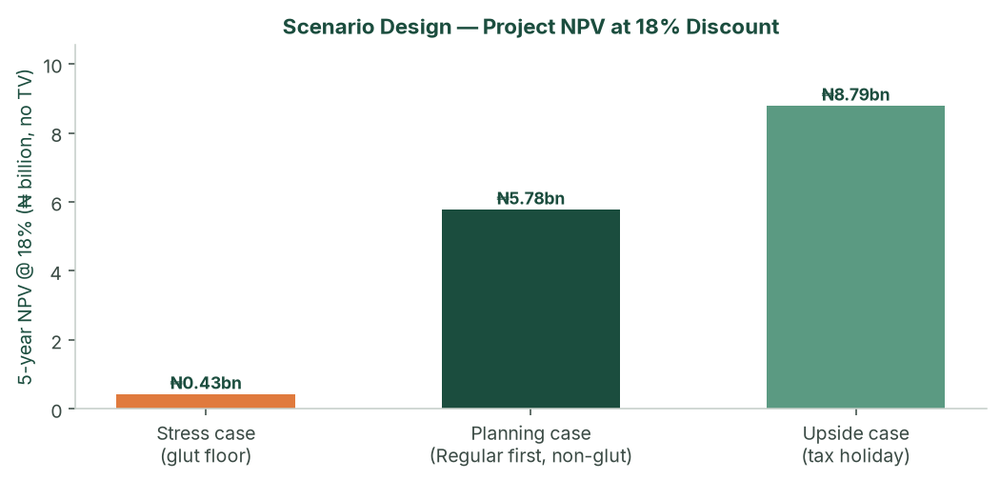

*Figure: Three designed scenarios — stress, base (planning) and upside — 5-year NPV at an 18% agri-risk discount, no terminal value.*

### Feasibility verdict

The venture is **feasible**. It combines (a) a structural national supply deficit for fresh tomatoes, (b) a durable Ogun–Lagos logistics advantage versus long-haul northern producers, (c) a two-cycle calendar that starts on Regular at a non-glut Mile 12 price and then captures Peak scarcity at 3 ha, and (d) a cycle-level 50/50 allocation that funds land under cultivation while building a cash buffer. The pace of the plan is governed by how quickly new land can be prepared, staffed and irrigated — not by how much capital is available after Cycle 2.

---

## 2. Business Overview & Strategic Model

### 2.1 Legal entity and incorporation

The farm trades as **SNLB Farms**. The vehicle on file at the Corporate Affairs Commission is the business name **SNLB ENTERPRISE**.

| Field | On the CAC certificate |
| --- | --- |
| Registered name | **SNLB ENTERPRISE** |
| Registration type | Business name under CAMA 2020 (not a company) |
| Registration no. | **BN 6922259** |
| Date | 31 March 2023 |
| Issued at | Abuja (Registrar-General Hussaini Ishaq Magaji, SAN) |
| Nature of business | Agricultural services, general trading and merchandise |
| Principal place of business | 17 Ugochukwu Orji Street, Westgate Estate, Igbo Efon, Lekki, Lagos State |
| Certificate in data room | `legal/SNLB_ENTERPRISE_CAC_BN_6922259.pdf` |

A business name is a trading style of the proprietor. It has **no separate legal personality**, **unlimited personal liability**, and is a weak party for a master lease, a FarmPark SLA, NAIC loss-payee language, or a later BOA/NIRSAL file. Cycle 1 can legally run on the BN. This study’s credit path, FarmPark contract and lease assignment assume a **private company limited by shares**.

**Conversion used in this plan (counsel files; RC number is not invented here).**

| Item | Planning position |
| --- | --- |
| Proposed company | **SNLB Farms Limited** (or a counsel-cleared close variant) |
| Trading style | SNLB Farms; BN 6922259 retired or kept only if counsel so advises |
| Law | CAMA 2020 private company limited by shares |
| Objects | Commercial crop production (tomato and allied vegetables); irrigation and farm-input procurement; packing, haulage and sale of fresh produce; power to lease, option and own farmland; power to borrow and to grant security |
| Authorised share capital (illustration) | ₦10,000,000 ordinary shares of ₦1 each |
| Paid-up at first planting | **₦8,000,000** — the opening pack, allotted as share capital into the company account (not an undocumented director loan) |
| Unissued | ₦2,000,000 (headroom for a later allotment; not a second 100 ha) |
| Registered office (until changed) | 17 Ugochukwu Orji Street, Westgate Estate, Igbo Efon, Lekki — same as the BN |
| Farm / operating site | Ogun State master block (lease/option address on the land papers) |
| Directors | Promoter at incorporation; one independent with agribusiness or audit experience from Cycle 3 (§8.3) |
| Bank | Dedicated naira operating account **in the company’s name**; ₦8 million paid in before transplant |
| Tax | TIN from Cycle 1; planning case is fully taxed at 34%; NTA 2025 agri holiday is upside only, on a tax opinion |
| Counterparties | Master option/lease, FarmPark advisory letter, NAIC/GIT and seed/drip deposits are signed by **SNLB Farms Limited** once the RC issues. Until then, the BN may sign Cycle 1 papers only with counsel’s note that they will be novated. |

**Corporate pack (data room).** CAC BN certificate; CAC status report (proprietor name as on the register — not printed on the face of the certificate held here); after conversion: certificate of incorporation, MEMART, Form CAC 1.1 / status report, share register, board minutes allotting ₦8 million, TIN, account-opening pack, promoter KYC (NIN, BVN, ID, PEP). Proprietor/shareholder identity is taken from the CAC status report, not guessed in this study.

Pre-ops weeks −16 to −14: counsel on the option/lease **and** the Ltd conversion; open the company account; pay in ₦8 million as paid-up capital.

### 2.2 Concept & business model

The venture leases (and options) the full contiguous 100-hectare block in Ogun State before operations begin, then brings parcels into cultivation as retained profit allows. Because the block is already secured, each expansion step is operational — drip, land prep, staffing — rather than a new land negotiation.

- **Cycle 1 — Regular Season (non-glut price).** One hectare; harvest into the December–June window at ₦33,000/basket; first track record and first Mile 12 relationships.
- **Cycle 2 — Peak Season.** Three hectares; harvest into July–November scarcity at ₦145,000/basket; first high-margin cash generation.
- **From Cycle 3.** Regular and Peak alternate on the growing footprint. Produce moves Ogun → Mile 12 in about 1.5 hours, in 50 kg baskets, until the Cycle 5 bulk transition.

The land structure used in the model is the one a lender or careful promoter would want: **₦200,000/ha/year** on cultivated hectares plus a **₦25,000/ha/year holding fee** on unused option land, with the lease/option assignable. Lease-to-own conversion from Year 2, funded from the buffer, builds collateral.

### 2.3 Capital allocation — the 50/50 rule

At the close of **every cycle**:

- **50% reinvested** — next-cycle working capital, drip on newly added hectares, and triggered shared infrastructure (boreholes, packing shed, packhouse).
- **50% retained as buffer** — weather, pest, weak-price or mobilisation delay, without a pause in operations.

Hectares are added only up to what the reinvestment pool can fund, and never more than **+45 ha** in one cycle. From Cycle 4 the operating ceiling, not cash, binds.

### 2.4 Mechanization roadmap

The venture is asset-light. Machinery is rented per cycle from a farm-management company as acreage crosses defined thresholds. Discounts apply to **base production cost only**.

| Stage | Trigger | Approach | Effect on unit cost |
| --- | --- | --- | --- |
| Stage 0 — Manual | < 5 ha | Manual land prep; FMC in advisory capacity | Baseline |
| Stage 1 — Rented core fleet | 5–24 ha | Tractors and tillers rented per cycle | ≈7% |
| Stage 2 — Bulk + fleet | 25–59 ha | Bulk inputs plus expanded rented fleet | ≈14% |
| Stage 3 — Full mechanization | ≥ 60 ha | Master service contract; optional owned implements | ≈20% |

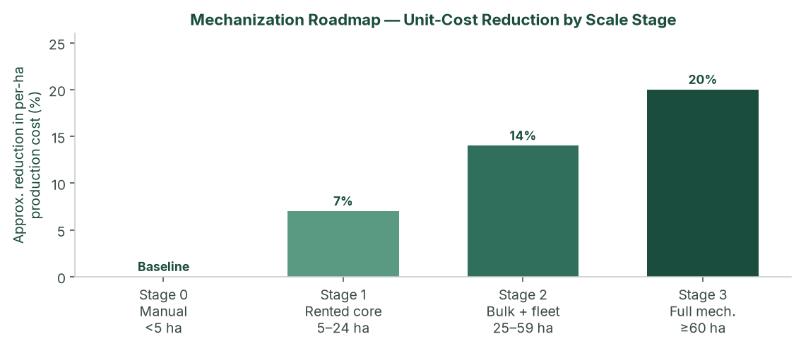

*Figure: Mechanization stages and approximate per-hectare cost reduction. Applied as a discount to base production cost in the financial model.*

### 2.5 Value proposition

- **Strategic market access.** 1.5-hour transit to Mile 12 versus 36–48 hours from the north, cutting post-harvest spoilage to under 5% against 40%+ for long-haul competitors.
- **Countercyclical supply.** Reliable volume in the months when the broader market is scarcity-constrained.
- **Scalable, capital-light growth.** Self-funded path from 1 to 100 ha in three years, without owning a tractor fleet.
- **Self-funding resilience.** The 50/50 policy funds growth and insulates against a single bad cycle.

### 2.6 Competitive advantages

- **Capital wall.** All-in production of roughly ₦3.4m–₦3.8m per hectare (planning case, before scale discounts) keeps casual entrants out.
- **Know-how.** Two-cycle timing, hybrid seed, drip and mechanization coordination.
- **Geographic insulation.** Ogun is structurally less exposed to northern *Tuta absoluta* (“tomato Ebola”) outbreaks that drive the price spikes Peak cycles are timed to meet.
- **Auditable track record.** Cycle-level books from harvest one make the venture financeable if external capital is later sought.

### 2.7 SWOT analysis

| | Helpful | Harmful |
| --- | --- | --- |
| **Internal** | **Strengths:** Ogun proximity (1.5 h vs 36–48 h north); two-cycle scarcity capture after a Regular start; 50/50 discipline; master option/lease; drip from Cycle 1; asset-light mechanization; phased drip and packhouse CapEx inside the model. | **Weaknesses:** Mile 12 concentration until Cycle 5; operational bandwidth (staffing and land prep) binds before capital; thin management in early cycles; working-capital intensity per hectare; no owned cold chain until the Cycle 5 packhouse trigger. |
| **External** | **Opportunities:** Structural deficit and US$350–400m paste imports; processor offtake (Dangote, Tomato Jos); NATIP, ACGSF, Ogun SAPZ; NTA 2025 agri tax holiday on the upside case; lease-to-own collateral. | **Threats:** January 2025 glut prints of ₦13–15k if Regular is a crash not a non-glut week; input inflation (NBS food 16.96% May 2026); Peak pest pressure; new southern intensive entrants; lease/tenure defect; Regular harvest at 72 ha without bulk contracts. |

---

## 3. Market Analysis

### 3.1 Macro market — the Nigerian tomato industry

Nigeria is Africa’s second-largest tomato producer (≈**3.7 million tonnes**) and still imports an estimated **US$350–400 million** of tomato paste a year. Tomatoes are a staple vegetable with inelastic household demand. The paradox — large output, large imports, violent retail spikes — is explained by rain-fed smallholder yields of **4–10 t/ha**, **40–50%** post-harvest loss on the north–south corridor, and recurring *Tuta absoluta* events that can destroy 50–100% of affected northern fields.

Policy is supportive rather than a cash input to the model: NATIP 2022–2027, ACGSF (up to 75% guarantee on qualifying agricultural loans), FX frictions on some paste imports, and Ogun State’s Special Agro-Industrial Processing Zone.

### 3.2 Micro market — Mile 12 International Market, Lagos

Mile 12 absorbs an estimated **1,000+ tonnes of tomatoes a day** for a Lagos population above 20 million. Price discovery is daily, auction-style, in 50 kg “big baskets.” Selected verified points (not a continuous series; gaps are not interpolated):

| Period | 50 kg basket | Context |
| --- | --- | --- |
| Aug 2024 | ₦50,000 | Seven-month low; down 58% from ~₦120,000 Jan/Feb 2024 |
| Dec 2024 | ₦35,000–₦55,000 | Dry-season glut, quality-dependent |
| Jan 2025 | ₦13,000–₦15,000 | Deep glut — **stress-case Regular floor** |
| Feb 2025 | ₦40,000 | Recovery |
| Late May / early Jun 2026 | ₦60,000–₦70,000 | Inter-peak trough |
| Early Jul 2026 | ₦120,000–₦150,000 | Scarcity spike — **planning Peak reference** |

The **planning case** sells Regular at **₦33,000** (non-glut Mile 12 price for graded hybrid fruit — the original operating ticket, inside the Dec 2024 ₦35,000–₦55,000 cluster) and Peak at **₦145,000** (July 2026 scarcity print). **₦22,000 is not the Regular plan**; it is a weak-glut caution. The **stress case** uses the January 2025 crash (₦15,000) and a weak Peak (₦55,000).

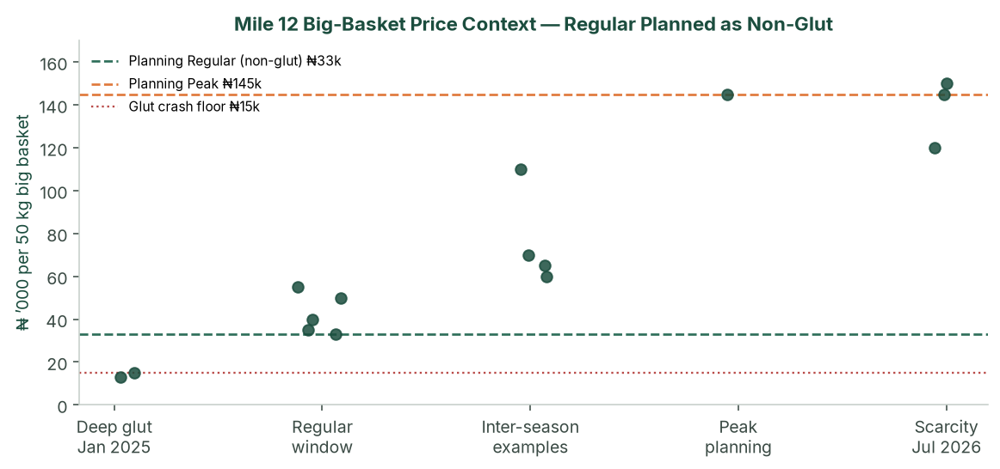

*Figure: Selected Mile 12 big-basket points against planning prices (₦33k non-glut Regular / ₦145k Peak). Cycle 1 is Regular at the non-glut ticket, not at the January crash.*

### 3.3 Value chain positioning

About **98%** of national production comes from smallholders on 1–5 ha plots, selling as price-takers to aggregators who truck produce 1,000+ km south and typically lose 40%+ of the load. By supplying Ogun → Mile 12 directly, the venture skips aggregator and long-haul layers, offers a fresher graded product, and is positioned for processor offtake at scale.

### 3.4 Competitive landscape

| Cohort | Versus this venture |
| --- | --- |
| Northern smallholders and aggregators | Dominant volume; high spoilage; create the scarcity Peak cycles sell into |
| Large northern commercial (e.g. Olam-Caraway, Jigawa) | Demonstrated 30–40 t/ha; still long-haul to Lagos; more processing-oriented |
| Southern / peri-Lagos intensive growers | Limited scale today; capital wall plus two-cycle know-how is the barrier |
| Processors (Dangote Tomato, Tomato Jos) | Structurally short of consistent fruit — Cycle 5+ offtake, not Cycle 1 cash |

### 3.5 Demand outlook & addressable market

At 100 ha the planning case produces **3,800 tonnes per year** (Years 4–5). That is about **3–4 days** of Mile 12 throughput — material to named wholesalers, not to the terminal as a whole — provided Cycle 5 bulk contracts are in place.

Offtake design from Cycle 5: ~50% standing wholesale contracts, ~20% processor/institutional, ~30% Mile 12 spot. No single counterparty above **40%** of a cycle without board consent. Two letters of intent before Cycle 3; a bulk term sheet before Cycle 5 planting — or the +45 ha Regular step waits for the next Peak.

---

## 4. Site, Agronomy & Operations

### 4.1 Ogun State growing conditions

Deep, well-drained soils suitable for intensive irrigated tomato; 1.5-hour corridor to Lagos; SAPZ road and tenure context; two climatic windows that map onto Peak and Regular. **Soil laboratory tests and a borehole yield/quality test on the first 10 ha are conditions of first planting.** Until those exist, yield is a planning assumption. The planning case uses the agronomic target because drip and best practice are in from Cycle 1.

### 4.2 Hybrid seed and yield

Cultivars: **Eva F1 / Platinum F1**, with NIHORT HortiTom4 / HortiTom5 (reported potential 21.7–27.2 t/ha) on a side-by-side trial from Cycle 2.

| Source | Yield |
| --- | --- |
| Smallholder rain-fed | 4–10 t/ha |
| NIHORT intensive guidance | 20–40 t/ha |
| Olam-Caraway (Jigawa) | 30 t/ha out-grower; up to 40 t/ha company fields |
| **Agronomic and planning yield** | **20 t/ha Regular / 18 t/ha Peak** |
| **Stress case** | **15.0 / 13.5 t/ha** |

Unit convention: 1 tonne = 20 baskets of 50 kg. Peak yield is 10–12% below Regular for rainy-season disease pressure. Each cycle is 60–90 days transplant to harvest.

### 4.3 Two-cycle production calendar

| Cycle | Window | Planning yield | Planning price | Role |
| --- | --- | --- | --- | --- |
| Regular (Cycle 1 first) | Dec–Jun | 20 t/ha (400 baskets) | ₦33,000/basket | Establishing cycle at a **non-glut** Mile 12 ticket |
| Peak (Scarcity) | Jul–Nov | 18 t/ha (360 baskets) | ₦145,000/basket | Scarcity capture; footprint expanded ahead of every Peak |

Planting weeks are reverse-engineered from the target Mile 12 window. **A Peak harvest that misses the scarcity window is the principal operating way to weaken the plan.** Cycle 1 stays Regular so the farm is proven before that window.

#### How Cycle 1 earns the non-glut Regular price

December–June is a long window. January 2025 printed ₦13,000–₦15,000; December 2024 and February 2025 printed ₦35,000–₦55,000 and ₦40,000. The ₦33,000 planning ticket is the non-crash Regular market — not an average of the crash. Cycle 1 is therefore timed to **harvest February–April**, after the January trough and before Peak.

| Step | Timing (illustrative) | Purpose |
| --- | --- | --- |
| Nursery | Late October – late November | 3–4 week hybrid seedlings, hardened |
| Transplant | Late November – mid December | Miss a January-only harvest |
| Vegetative / first flower | December – January | Fertigation and scouting; do not flood the January auction |
| Harvest | February – April | 5–6 week pick; sell into the non-glut Regular cluster |
| Cycle close | April | 50/50 split; prepare +2 ha for Peak transplant ~May |

If the farm is not ready for a November nursery, wait for the next Regular window rather than transplanting into a January harvest. Peak (Cycle 2) is then reverse-engineered from a July–November scarcity sale.

### 4.4 Irrigation, soil and pest management

Drip plus fertigation on every productive hectare; shared mainlines across the master block. Opening CapEx ₦3.5 million (headworks + 1 ha). Incremental **₦1.0 million per additional hectare**, plus triggered shared works: second borehole ₦6 million at 15 ha; packing shed ₦8 million at 27 ha; packhouse, cold room and third borehole ₦40 million at 72 ha.

IPM: resistant hybrids, traps, scouting, biologicals where feasible, targeted chemistry. Ogun is insulated from the main northern *Tuta* belt; Peak season is still modelled as higher cost and lower yield.

Indicative water duty 4,000–6,000 m³/ha/cycle under drip, to be replaced by the agronomist. At 5,000 m³/ha, Cycle 1 needs about **5,000 m³** over 90 days (~55 m³/day). A small borehole (2–4 m³/hour) covers 1 ha. At 100 ha the same duty is ~500,000 m³/cycle — which is why borehole design is sized to the full block **before Cycle 5**, not improvised at 72 ha.

### 4.5 Post-harvest handling, logistics and Mile 12 selling

Plastic crates from Cycle 1 (not raffia). Spoilage target **<5%**. Yields in the model are already net of a small field loss. Insulated or refrigerated trucking at **₦900/basket** in the planning case. Grading on size, colour, firmness and defects. Speed-to-market is the cold chain until the Cycle 5 packhouse.

**Cycle 1 does not flood Mile 12.** 20 t on 1 ha is 400 baskets over a 5–6 week harvest — about **10–15 baskets per selling day** (1–2 small loads), not a terminal event. The 1,000+ t/day Mile 12 throughput absorbs that without moving the market.

How the first 400 baskets are sold:

- Grade to a **firm, hybrid, crate-packed** spec so the fruit trades with Jos-type Grade A, not the cheap soft local basket.
- Open a **buyer log** of 5–8 Mile 12 wholesalers from week one of harvest; sell to two or three names, not a single dump.
- Arrive early (pre-auction tightness), weigh and grade on the floor, cash T+0 to T+3.
- Keep a daily price log against the ₦33,000 plan. If prints sit at ₦15,000–₦20,000 for a week, that is the stress case — see the Cycle 1 go/no-go in §6.14. Do not “average up” in the books.

### 4.6 Staffing plan

Seasonal field labour sits inside per-hectare production cost. Management scales with acreage and is the binding operational constraint from Cycle 4.

| Role | Cycles 1–2 (1–3 ha) | Cycles 3–4 (15–27 ha) | Cycles 5–6 (72–100 ha) |
| --- | --- | --- | --- |
| Farm manager | 1 | 1 | 1 senior |
| FarmPark (advisory / later SLA) | Lekki advisory; not a substitute for the on-site manager | Optional mechanization coordination | Master service only if C4 mobilisation was real |
| Field supervisors | 0 | 1–2 | 4–6 |
| Logistics / Mile 12 | Owner | 1 | 2 |
| Finance & admin | Owner | 1 | 2–3 |
| Modelled monthly management payroll | ₦70,000 | ₦550,000 | ₦2,600,000 |

PAYE, pension (Pension Reform Act 2014) and NSITF/ITF are quantified with advisors as payroll formalises.

Harvest labour on 1 ha: **8–12 pickers**, two to three picks a week for 5–6 weeks, plus crate handling and one driver/owner run to Mile 12. That crew sits inside the ₦612,000 Regular seasonal-labour line. At 72–100 ha the same pattern scales; it is why the 45 ha/cycle ceiling exists.

### 4.7 Sales-unit transition — baskets to bulk

The 50 kg basket is the primary unit through Cycle 4 (27 ha). From Cycle 5 (72 ha), ≈70% of output moves to standing bulk contracts at a 10% discount to spot (7% blended haircut, built into every scenario). ≈30% remains Mile 12 spot for price discovery.

### 4.8 Production cost build-up (planning case, Year 1, pre-mechanization discount)

| Line (share of base) | Regular ₦/ha | Peak ₦/ha |
| --- | --- | --- |
| Hybrid seed & seedlings (30%) | 1,020,000 | 1,140,000 |
| Fertilizer & fertigation (20%) | 680,000 | 760,000 |
| IPM / crop protection (12%) | 408,000 | 456,000 |
| Seasonal labour (18%) | 612,000 | 684,000 |
| Irrigation operating cost (8%) | 272,000 | 304,000 |
| Staking, twine, mulch (7%) | 238,000 | 266,000 |
| Nursery & miscellaneous (5%) | 170,000 | 190,000 |
| **Base production cost** | **3,400,000** | **3,800,000** |

NAIC arable cover is **2% of production cost on top**. Quotations replace these shares before a BOA appraisal.

### 4.9 Cycle 1 field pack — how 20 t/ha is built on 1 ha

The 20 t/ha Regular yield is not a later-cycle prize. It is the intensive drip stand on hectare one.

| Item | Cycle 1 planning pack |
| --- | --- |
| Net cultivated area | 1.0 ha (beds, paths and tank inside the hectare) |
| Plant population | ≈22,000–25,000 plants/ha (hybrid, transplanted) |
| Spacing (indicative) | Double-row on drip laterals; 30–40 cm in-row |
| Cultivar | Eva F1 / Platinum F1; HortiTom strip from Cycle 2 |
| Nursery | 3–4 weeks; 10% extra seedlings for gaps |
| Irrigation | Drip + fertigation from transplant; mulch; staking/trellis |
| Harvest | Breaker/turning stage; 2–3 picks/week; plastic crates |
| Output | 20 t = 400 × 50 kg baskets, net of a small field loss |

Indicative bill against the ₦3.4 million Regular production line is itemised in §6.11 (August 2026 shop tickets). Opening CapEx (₦3.0 million) is borehole, 1 ha drip, small genset, 40 crates and tools — the kit that makes this stand possible.

### 4.10 Quality specification — how ₦33,000 is earned

₦33,000 is a **grade**, not a hope. Cheap, soft, raffia-packed local fruit prints ₦13,000–₦25,000 even in mixed weeks. Firm hybrid in crates prints with Jos-type Grade A (₦35,000–₦55,000 in ordinary Regular surveys). Cycle 1 fruit must meet a written spec before it leaves the farm:

| Attribute | Cycle 1 spec |
| --- | --- |
| Cultivar | Named hybrid (Eva F1 / Platinum F1); no recycled seed |
| Ripeness | Breaker to turning; no fully red overripe on the vine |
| Firmness | Thumb test; reject soft, cracked or watery fruit |
| Size / colour | Uniform; defects and sunscald out |
| Pack | Clean plastic crate, 50 kg net, no raffia |
| Residue | Spray interval observed; no harvest the day of chemistry |
| Spoilage in transit | <5%; insulated/crate haul, 1.5 hours |

Fruit that fails the spec is sold as a second grade or dumped — it is not mixed into the ₦33,000 lot. That is how the non-glut Regular ticket is defended on the Mile 12 floor.

### 4.11 Power, pumping and farm security

Drip on 1 ha needs reliable pumping, not grid hope.

- **Cycle 1 power.** A small diesel genset (or hybrid solar-pump where the borehole yield allows) is part of the ₦3.0 million opening kit. Budget fuel inside the ₦272,000 irrigation operating line. Keep 72 hours of diesel on site.
- **Spares.** One spare pump, fittings and a drip-repair kit on hectare one. Irrigation failure is a yield event, not a maintenance inconvenience.
- **Security.** Night watch on the nursery and drip headworks from transplant. Haul cash is T+0 to T+3 — two-person Mile 12 runs, no overnight cash on the farm. GIT cover is already in the model.
- **Host community.** Written access for labour and a simple grievance channel before Cycle 1. Prefer local harvest crews. This is social licence, not CSR theatre; a blocked gate at 72 ha is an operating risk.

### 4.12 Input procurement lead times

Cycle 1 fails if seed and drip arrive after the November nursery window.

| Item | Lead time | Action |
| --- | --- | --- |
| Certified hybrid seed | 8–12 weeks (import / authorised distributor) | Order before nursery; 10% extra for gaps |
| Drip laterals, filters, fertigation tank | 4–8 weeks | Deposit after soil/water pass; install before transplant |
| Fertilizer and soluble feed | 2–4 weeks | First cycle on quotation; bulk from Cycle 3 |
| Crates, twine, mulch, traps | 2–3 weeks | On site before transplant |
| NAIC / GIT bind | 2–3 weeks | Bind before transplant, not after |

FX on imported seed and drip is managed by **naira quotations and early order**, not by hoping the naira holds. That is already the planning assumption; it is an operating task in months −4 to −1.

### 4.13 Farm-manager KPIs (Cycle 1–2)

The farm manager is paid against cycle packs, not against hope.

| KPI | Cycle 1 target | Cycle 2 target |
| --- | --- | --- |
| Yield (net) | ≥ 18 t/ha (plan 20) | ≥ 16 t/ha Peak (plan 18) |
| Spoilage in transit | <5% | <5% |
| Average realised ₦/basket | ≥ ₦30,000 Regular | Peak window hit (Jul–Nov sale) |
| Spray / harvest interval | Spec held | Spec held |
| Cycle close pack | Within 21 days of last sale | Same |

Missed Peak timing is a farm-manager miss, not a market miss.

### 4.14 Intended farm-management partner — FarmPark (Lekki)

The promoters intend to engage **FarmPark**, office at Suite 2, 3rd Floor, King’s Deck, Alternative Route off Chevron Drive, Lekki, as the farm-management company. Trading name FarmPark / farmpark.ng. Job boards state that **Farm Park is a trademark of FarmAgro Projects Limited** and also use **FarmPark Limited**. Founding Executive Director: **David Omaghomi**. Contacts they publish: 0708 062 9726, care@farmpark.ng.

The SNLB contracting party is **SNLB ENTERPRISE** (BN 6922259) until **SNLB Farms Limited** is incorporated (§2.1). The Cycle 1 advisory letter is novated to the Ltd when the RC issues.

#### How FarmPark operates

They sell three products in one loop: **farmland acquisition**, **co-investment** (share profits and risk), and **expert farm management** so the client does not farm. Client-services staff close after **site tours**. Tomato is in scope only as produce the client chooses. Website figures (500 acres, 85% “annual yield”) are unverified and are **not** used in this model.

The default FarmPark product (they bring land and co-investors, pick the sector, remit returns) is **not** the engagement. FarmPark is useful only as a **contractor on SNLB’s Ogun block**. Livestock diversification as risk management does not apply: this block is tomato only.

#### How that sits on this tomato farm

SNLB’s crop, calendar, land and P&L are already locked.

| Tomato-farm activity | SNLB | On-site farm manager | FarmPark (intended C1–2 advisory) |
| --- | --- | --- | --- |
| 100 ha option and ₦8.0 million | Holds both | — | Does not sell land or pool capital |
| Hybrid tomato, drip, 20/18 t/ha | Accountable | Daily | Advise spec, calendar, fertigation, labour gang |
| Regular harvest Feb–Apr; Peak Jul–Nov | Accountable | Executes | Calendar and Peak IPM; no livestock on the block |
| Grade, crate, Mile 12, cash T+0 | **Sells** | Supports | Informed only — does not take the floor or remit “investor returns” |
| 50/50 NPAT | Stays inside SNLB | — | Naira retainer / later SLA; **no profit share** |
| Mechanization at 5 / 25 / 60 ha; +45 ha | Accountable | Coordinates | Optional SLA from C3; written mobilisation before C4 |

A weekly photo pack is reporting, not the operator. If they cannot show a tomato or intensive-vegetable farm you can walk, keep them as land/admin advisor and hire the agronomist separately.

**Engagement shape.** Cycles 1–2 remain Stage 0: FarmPark on **advisory** terms; a named farm manager on the Ogun site. A mechanization SLA is still required before Cycle 4. The full operating file, RACI and gap list sit in **Appendix F**. Until CAC papers, a Cycle 1 advisory letter and a reference-farm visit are in the data room, FarmPark is a **named intention**, not a closed CP.

---

## 5. Growth & Expansion Roadmap

### 5.1 Master block strategy

A master option/lease is executed across the contiguous 100-hectare block before operations begin. Bringing a new parcel into cultivation is then irrigation, land preparation and staffing — not a new legal negotiation.

### 5.2 Cycle-by-cycle organic expansion

The path is 1 → 3 → 15 → 27 → 72 → 100 ha. Jump sizes are what the reinvestment pool can buy, subject to the 45 ha/cycle ceiling. Cycles 1–4 are cash-unconstrained after Cycle 2 Peak; from Cycle 4 the ceiling binds.

| Cycle | Added | Area | Mech. | Planning revenue | Planning NPAT | Cycle CapEx |
| --- | --- | --- | --- | --- | --- | --- |
| C1 Y1 Regular | start | 1 ha | 0 | ₦13.2m | ₦4.54m | opening at t=0 |
| C2 Y1 Peak | +2 | 3 ha | 0 | ₦156.6m | ₦92.9m | ₦2.0m drip |
| C3 Y2 Regular | +12 | 15 ha | 1 | ₦198.0m | ₦83.2m | ₦18.0m drip + borehole |
| C4 Y2 Peak | +12 | 27 ha | 2 | ₦1,409.4m | ₦846.0m | ₦20.0m drip + shed |
| C5 Y3 Regular | +45 | 72 ha | 3 | ₦883.9m | ₦361.2m | ₦85.0m drip + packhouse |
| C6 Y3 Peak | +28 | 100 ha | 3 | ₦4.85bn | ₦2.88bn | ₦28.0m drip |

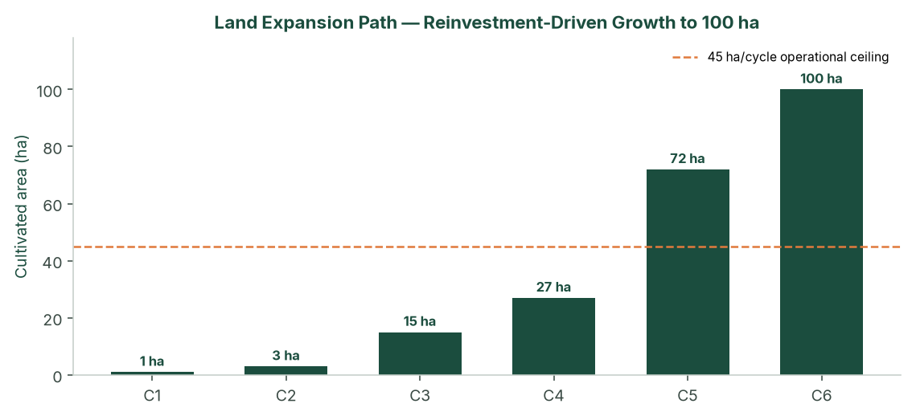

*Figure: Land expansion path by cycle (reinvestment-driven, capped at +45 ha/cycle).*

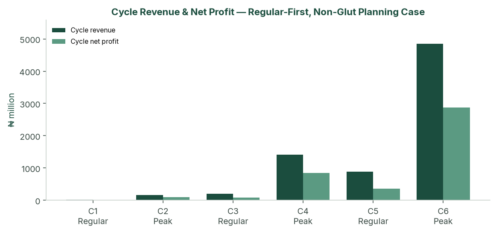

*Figure: Cycle revenue and net profit — Regular-first planning case (₦ million). Peak cycles dominate value creation.*

Do not plant +45 ha Regular in Cycle 5 unless that harvest is contracted; the add can wait for the following Peak without breaking the three-year idea of the plan.

### 5.3 Lease-to-own pathway

From Year 2, selected parcels convert to owned land where the lease allows, using buffer reserves. This is not required for the P&L to work. It strengthens the balance sheet and provides real-asset backing for any later facility or downstream investment.

### 5.4 Implementation timeline

| Phase | Timing | Key activities |
| --- | --- | --- |
| Pre-operations | Months −4 to 0 | See 16-week countdown below |
| Cycle 1 Regular | Months 0–6 | 1 ha at non-glut Regular price; Mile 12 buyer log; cycle-close pack; 50/50 split; prepare +2 ha |
| Cycle 2 Peak | Months 6–12 | 3 ha Peak; first high-margin harvest; reinvestment into +12 ha |
| Cycles 3–4 | Year 2 | 15 → 27 ha; Stage 1→2 mechanization; finance hire; two offtake LOIs; optional ₦80m facility; selective lease-to-own |
| Cycles 5–6 | Year 3 | 72 → 100 ha; Stage 3; packhouse; 70/30 bulk/spot; full team |
| Steady state | Year 4+ | Dual-cycle 100 ha; yield/cost improvement; optional processing from buffer (separate study) |

**16-week pre-ops countdown (before Cycle 1 transplant)**

| Week | Gate |
| --- | --- |
| −16 to −14 | Counsel on master option/lease; **§2.1** Ltd conversion (SNLB Farms Limited); open company account; ₦8m paid in as share capital |
| −14 to −12 | Soil lab + borehole yield/quality on first 10 ha; survey |
| −12 to −10 | Seed and drip quotations; **FarmPark** Cycle 1 advisory letter; farm-manager hire |
| −10 to −8 | NAIC/GIT bind; crate and input orders; genset/pump confirmed |
| −8 to −6 | Drip install on 1 ha; nursery started |
| −6 to −4 | Fertigation trial on a short lateral; IPM kit on site; buyer list started |
| −4 to 0 | Transplant window (late Nov – mid Dec); Cycle 1 budget signed; first scouting log |

If any of soil, water, seed or drip is late, **slip the transplant**. Do not compress nursery into a January harvest.

### 5.5 What the buffer is for

By Year 3 the planning case holds about **₦2.13 billion** in the 50% buffer. That cash is not a licence to start a paste plant, a second 100 ha, or export. Allowed uses, in order:

1. Next-cycle working capital and drip (already in the reinvestment half).
2. Lease-to-own deposits from Year 2 where the lease allows.
3. A missed Peak or a Regular crash (the stress case).
4. Packhouse quality if Cycle 4 cash is in — not because the NPV needs it.
5. Short naira instruments (Treasury bills) for cash that exceeds the next two cycles’ opex. No related-party loans, no FX speculation, no processing until a separate study.

### 5.6 Offtake heads of terms (from Cycle 5)

Cycle 1–4 are Mile 12 cash sales. From Cycle 5 (~70% bulk) a one-page term sheet, not a handshake:

| Term | Planning position |
| --- | --- |
| Product | Graded fresh tomato, hybrid, crate or bulk bin, spec as §4.10 |
| Volume | ~70% of the cycle; 30% remains Mile 12 spot |
| Price | 10% below the reference Mile 12 basket (7% blended haircut already in the model) |
| Window | Named weeks; Peak window is a condition for Peak cycles |
| Payment | T+3 to T+7; no open account beyond that |
| Concentration | No single buyer >40% of a cycle without a board note |
| Rejects | Spec failure is the farm’s; in-transit after dispatch is GIT |
| LOIs | Two letters before Cycle 3; signed term sheet before Cycle 5 planting |

If the term sheet is not signed, delay the +45 ha Regular step. The three-year path to 100 ha can wait one cycle; a 72 ha Regular dump cannot.

---

## 6. Financial Plan

The engine is `model/financial_model.py`. The **planning case** keeps the original sequence — Cycle 1 Regular, then Peak — at **non-glut** Mile 12 prices (₦33,000 / ₦145,000), agronomic yields, the complete cost stack, and full NTA 2025 tax. The **upside case** is the same crop path with the five-year agri income-tax holiday. The **stress case** stacks January 2025 glut Regular prices, weaker Peak, lower yields and 17% cost inflation.

### 6.1 Scenario design

| | Stress | **Planning (Regular first, non-glut)** | Upside |
| --- | --- | --- | --- |
| Yield Regular / Peak | 15.0 / 13.5 t/ha | **20 / 18 t/ha** | 20 / 18 t/ha |
| Price Regular / Peak | ₦15,000 / ₦55,000 | **₦33,000 / ₦145,000** | ₦33,000 / ₦145,000 |
| Production cost / ha | ₦4.25m / ₦4.75m | **₦3.4m / ₦3.8m** | ₦3.4m / ₦3.8m |
| Logistics / basket | ₦1,300 | **₦900** | ₦900 |
| Cost inflation | 17% | **12%** | 12% |
| Sale prices | Flat | **Flat** | Flat |
| First cycle | Regular | **Regular** | Regular |
| Tax | Full NTA 2025 (Y1 small-company 0%) | **34% (30% CIT + 4% levy)** | 5-year agri holiday |

All three cases include: phased CapEx, NAIC 2%, cargo 1.5%, management payroll, 5% contingency, D&A, holding-fee lease, 7% bulk haircut from Cycle 5, mechanization discounts 7/14/20%.

Prices are held **flat** while costs inflate. That is conservative for Years 1–3 and demanding for Years 4–5 — which is why the stress-case Year 5 EBIT margin compresses to 5%, and why any facility past Year 4 should include a price-review clause.

### 6.2 Year 3 comparison

| | Stress | **Planning** | Upside |
| --- | --- | --- | --- |
| Revenue | ₦1.68bn | **₦5.74bn** | ₦5.74bn |
| NPAT | ₦387m | **₦3.24bn** | ₦4.91bn |
| Net margin | 23.0% | **56.4%** | 85.5% |
| 5-yr NPV @ 18% (no TV) | ₦429m | **₦5.78bn** | ₦8.79bn |
| Cycle 1 | Loss ₦2.76m | **Profit ₦4.54m (MoS 52%)** | Profit ₦6.88m (holiday) |

The stress case remains NPV-positive at 18%. Cycle 1 can lose money if Regular prints the January 2025 crash (₦15,000) instead of the non-glut ₦33,000 ticket. Year 1 as a whole stays positive because Peak on 3 ha repairs it.

### 6.3 Planning-case annual P&L

| ₦ million | Y1 | Y2 | Y3 | Y4 | Y5 |
| --- | --- | --- | --- | --- | --- |
| Revenue | 169.8 | 1,607.4 | 5,738.5 | 6,082.2 | 6,082.2 |
| EBIT | 147.6 | 1,407.9 | 4,906.1 | 5,017.8 | 4,893.3 |
| EBIT margin | 86.9% | 87.6% | 85.5% | 82.5% | 80.5% |
| Tax @ 34% | 50.2 | 478.7 | 1,668.1 | 1,706.1 | 1,663.7 |
| **NPAT** | **97.4** | **929.2** | **3,238.0** | **3,311.8** | **3,229.6** |
| Net margin | 57.4% | 57.8% | 56.4% | 54.5% | 53.1% |
| Cumulative 50% buffer | 48.7 | 513.3 | 2,132.3 | 3,788.2 | 5,403.0 |

Output VAT: fresh produce treated as **exempt**. The planning case does not spend the agri tax holiday; that cash appears only in the upside case, subject to a written tax opinion.

### 6.4 Profit allocation (50/50)

| ₦ million | Y1 | Y2 | Y3 |
| --- | --- | --- | --- |
| 50% buffer (annual) | 48.7 | 464.6 | 1,619.0 |
| 50% reinvested | 48.7 | 464.6 | 1,619.0 |
| Cumulative buffer | 48.7 | 513.3 | 2,132.3 |

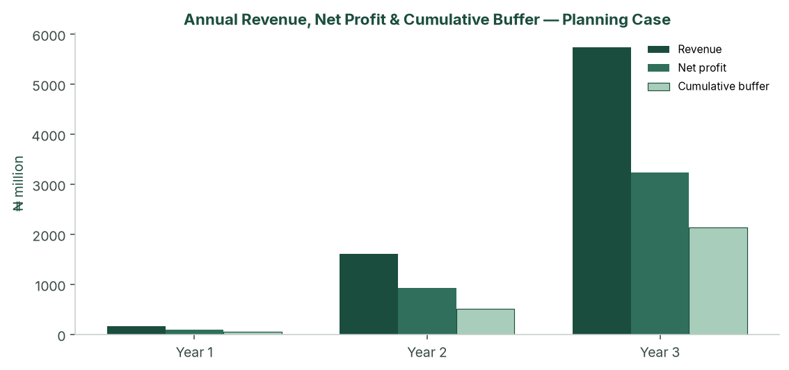

*Figure: Annual revenue, net profit and cumulative buffer — Regular-first planning case (₦ million).*

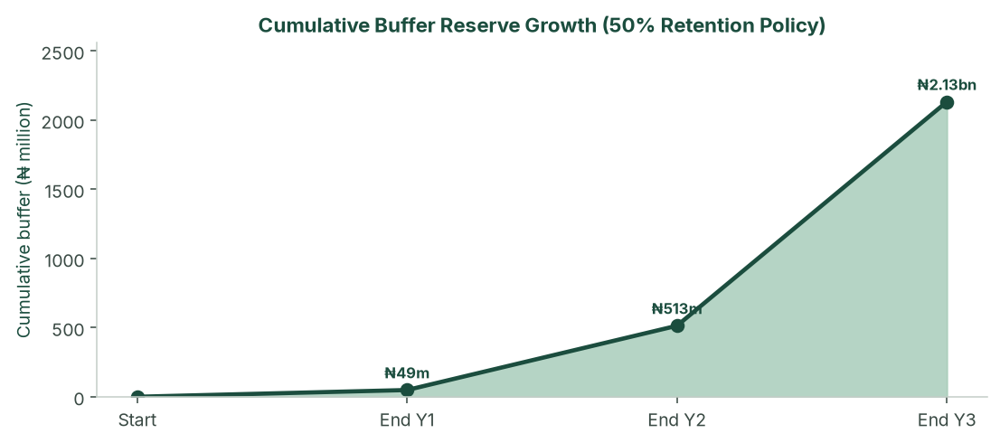

*Figure: Cumulative buffer reserve under the 50% retention policy — planning case.*

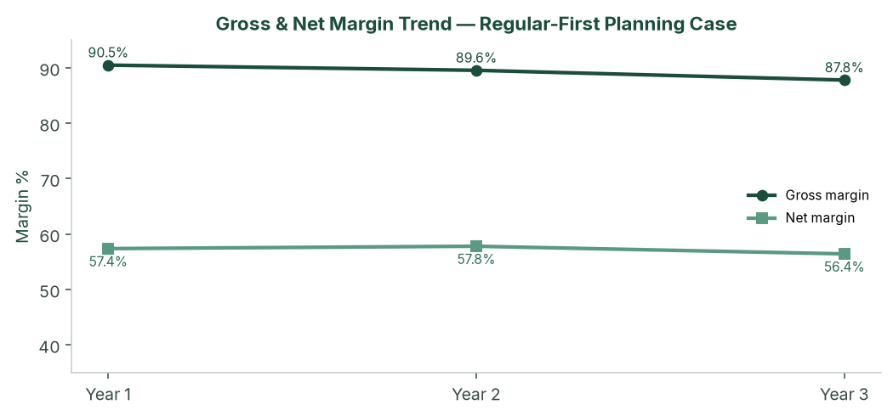

*Figure: Gross and net margin trend — planning case, three modelled build-out years.*

### 6.5 Cash flow and balance sheet (planning case)

| ₦ million | Y1 | Y2 | Y3 | Y4 | Y5 |
| --- | --- | --- | --- | --- | --- |
| CapEx | (5.5) | (38.0) | (113.0) | — | — |
| Owner equity | 8.0* | — | — | — | — |
| Closing cash | 100.8 | 997.8 | 4,146.7 | 7,484.8 | 10,740.6 |
| Net PPE | 5.6 | 37.8 | 126.9 | 100.7 | 74.4 |
| Debt | — | — | — | — | — |
| Equity | 106.4 | 1,035.6 | 4,273.7 | 7,585.4 | 10,815.0 |

\*Owner equity of ₦8.0 million at t=0. Mile 12 is modelled as cash sales (T+0 to T+3).

### 6.6 CapEx programme

Irrigation does not scale at zero marginal cost. The study phases drip, boreholes and packhouse as hectares come in.

| Trigger | Item | ₦ |
| --- | --- | --- |
| t = 0 | Headworks, 1 ha drip, crates, tools, legal | 3,500,000 |
| 3 ha (C2) | +2 ha drip @ ₦1.0m | 2,000,000 |
| 15 ha (C3) | +12 ha drip + second borehole | 18,000,000 |
| 27 ha (C4) | +12 ha drip + packing shed | 20,000,000 |
| 72 ha (C5) | +45 ha drip + packhouse / cold / third borehole | 85,000,000 |
| 100 ha (C6) | +28 ha drip | 28,000,000 |
| **Total through Year 3** | | **156,500,000** |

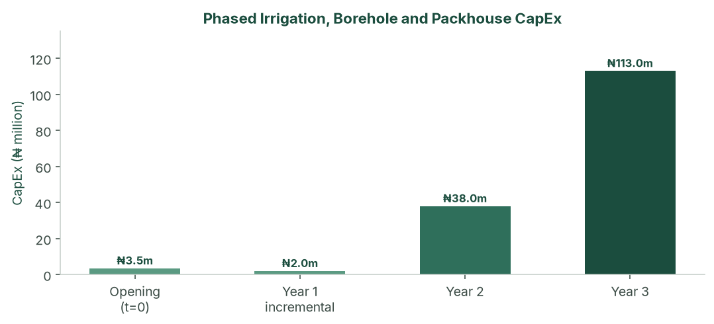

*Figure: Phased irrigation, borehole and packhouse capital expenditure. Funded from operations after Cycle 2 Peak. Cycle 5’s ₦85 million step is why Peak Cycle 4 must print.*

### 6.7 Break-even (Cycle 1 Regular — non-glut)

| | Stress | **Planning** | Upside |
| --- | --- | --- | --- |
| Break-even ₦/basket | ₦24,213 | **₦15,810** | ₦15,810 |
| Cycle 1 selling price | ₦15,000 | **₦33,000** | ₦33,000 |
| Margin of safety | −61.4% | **52.1%** | 52.1% |
| Cycle 1 NPAT | −₦2.76m | **₦4.54m** | ₦6.88m |

Planning-case payback on opening equity is **Cycle 2 Peak**, still inside Year 1.

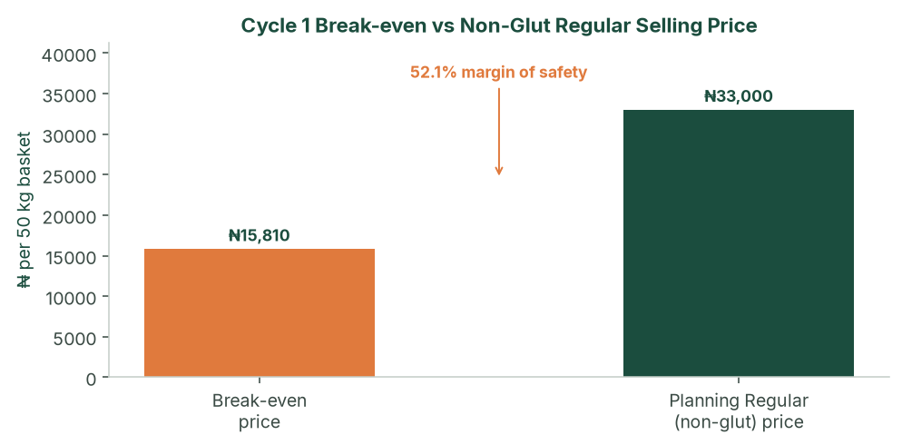

*Figure: Cycle 1 break-even price versus non-glut Regular selling price (52.1% margin of safety).*

### 6.8 Sensitivity

Peak cycles carry the enterprise. Regular is planned at a non-glut ₦33,000 ticket; a January-style crash is the stress case, not the plan. The designed stress case (yield −25%, Peak ₦55k, costs +25%, 17% inflation) is the stacked test.

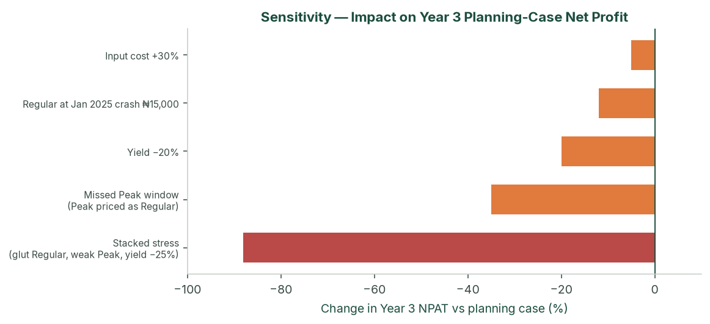

*Figure: Sensitivity of Year 3 planning-case net profit to price, yield and cost shocks, including the stacked stress case.*

A Peak window missed entirely (Peak price equal to Regular) is the operating kill scenario. Hold one full Peak NPAT in the buffer before the +45 ha step.

### 6.9 NPV, IRR and investment metrics (planning case)

Unlevered FCF = EBIT × (1 − 34%) + D&A − CapEx. t = 0 is −₦8.0 million in the engine.

| | t=0 | Y1 | Y2 | Y3 | Y4 | Y5 |
| --- | --- | --- | --- | --- | --- | --- |
| FCF ₦m | (8.0) | 96.3 | 897.0 | 3,148.9 | 3,338.0 | 3,255.8 |

| Discount | NPV |
| --- | --- |
| 10%, no terminal value | ₦7.49bn |
| **18%, no terminal value** | **₦5.78bn** |
| 18% + Gordon TV (g = 3%) | ₦15.55bn |

Project IRR on this path is very high because opening equity is small relative to Cycle 2 Peak cash. **NPV at 18%, Cycle 1 cash coverage, and DSCR (if geared) are the decision metrics** — not IRR.

### 6.10 KPIs (cycle pack, within 21 days of last sale)

Tonnes sold, average realised ₦/basket, spoilage %, cash / next-cycle opex, buffer balance, 50/50 split, next-cycle planting plan. Target spoilage <5%. Peak blended realisation at least ₦55,000 in the stress floor; Regular at least ₦15,000.

### 6.11 Sources & uses — what the ₦8 million is spent on

Indicative uses against **August 2026 retail**. Quotations replace every line before a drip deposit. Totals are locked to the original **₦8,000,000** pack (₦3.0 million CapEx + ₦5.0 million Cycle 1 working capital). Mix inside the pack can move when quotes land. Lease in this pack is **₦100,000 for the cultivated hectare only**; unused 99 ha sits on option/ROFR.

| Use | ₦ | Source | ₦ |
| --- | --- | --- | --- |
| Cycle 1 CapEx (water, drip, power, crates, tools) | 3,000,000 | Promoter equity | 8,000,000 |
| Cycle 1 working capital (inputs, labour, lease, logistics, tests, advisory) | 5,000,000 | Bank / DFI | — |
| **Total** | **8,000,000** | **Total** | **8,000,000** |

No bank or DFI facility is required to start. After Cycle 2 Peak, working-capital demand is met from internally generated cash. Cycle 5 (₦337 million opex + ₦85 million CapEx) proceeds only with Cycle 4 cash in the bank.

#### 6.11.1 Model 1-hectare tomato business plan (structure)

The public model is **Veggie Concept / Veggie Grow**, *Tomato Farming: Business Plan, Cost, Revenue and Profit* (2022 template, still republished). Copy the **shape**. Do not plant its **naira**.

| Model plan section | What it covers | This study |
| --- | --- | --- |
| Farm set-up | Drip, soil/water test, staff training | §4.4–4.12 and this pack |
| Business description | Plant → manage → harvest → sell | §2 |
| Market analysis | Mile 12, April–August scarcity, agents 5–10% | §3; SNLB sells itself, cash T+0 |
| Competitive analysis | Most farmers skip drip and get 4–10 t/ha | §2.6–2.7 |
| Sales strategy | Open market vs retail/hotels | §4.5 Mile 12 SOP; bulk from Cycle 5 |
| Cost / revenue / profit | Three price scenarios | Planning ₦33k / stress ₦15k / caution ₦22k |
| Notes and assumptions | Yield, seed type, labour, drip | §4.8–4.9 and the financial model |

Their 1 ha opex was **₦720,000** (seed ₦120k, labour ₦240k, fertilizer ₦200k, drip CapEx ₦625k). SNLB’s planning production cost is **₦3.4 million/ha Regular** plus CapEx, insurance, payroll and logistics — the intensive drip stand, not a 2022 backyard budget.

Other public references used for **structure and shop bands**, not as SNLB’s P&L:

- dripirrigation.com.ng — tomato drip steps: land prep → kit → water → layout → install → test. 1 ha laterals **₦500,000–₦1,250,000** (not borehole + genset).
- Farmsquare — 1-acre vegetable drip kit **₦450,000–₦600,000** (≈ ₦1.1–₦1.5 million per hectare of laterals).
- HTS Farms / FarmPays — August 2026 hybrid seed and soluble tickets (below).
- NIHORT intensive range 20–40 t/ha — this plan uses the **floor** (20 t Regular / 18 t Peak).

#### 6.11.2 CapEx — ₦3,000,000 (the kit)

Priced for **Ogun** (generally cheaper drilling than Lagos rock; still quote by the metre). A 9 kVA Mikano does **not** fit. Cycle 1 uses a small farm genset and a 2–4 m³/hour borehole.

| # | Item | 2026 shop band | Pack ₦ | Why this number |
| --- | --- | --- | ---: | --- |
| A1 | Borehole + casing (Ogun, farm depth) | ₦600,000–₦1,500,000 SW drill | 850,000 | Mid-low Ogun hole |
| A2 | Submersible pump, 2,000 L tank, fittings | Pump ₦300,000–₦900,000 | 300,000 | ~55 m³/day on 1 ha drip |
| A3 | 1 ha drip + filter + fertigation tank + install | ₦500,000–₦1,250,000/ha laterals | 950,000 | Inside the ₦1.0m/ha drip unit |
| A4 | Small diesel/petrol genset (≈2.5–3.5 kVA) | ~₦280,000–₦470,000 | 300,000 | Not a 9 kVA estate set |
| A5 | Spare pump + drip-repair kit | — | 50,000 | Irrigation failure is a yield event |
| A6 | Plastic crates (40 units) | ₦7,500–₦11,600 each | 320,000 | 40 × ₦8,000; turn ~10× over harvest (400 baskets) |
| A7 | Nursery shade, trays, knapsack, hoes, trellis, posts | — | 130,000 | Hardware that is not seed |
| A8 | Land prep 1 ha (plough/harrow/ridge) | ₦80,000–₦150,000 | 100,000 | Tractor hire; Stage 0 |
| | **CapEx** | | **3,000,000** | |

If the borehole bid exceeds ₦850,000: cut crates to 30, or a cheaper genset — **not drip**. If a working borehole already exists, keep A1–A2 (~₦1.15 million) inside CapEx (better fertigation, more crates, or a solar-assist pump). Do not treat that as spare profit.

#### 6.11.3 Working capital — ₦5,000,000 (the cycle)

Regular production **₦3.4 million** plus cash that still leaves the account before Mile 12 pays.

| Line | Pack ₦ | 2026 build |
| --- | ---: | --- |
| Hybrid seed + nursery (30%) | 1,020,000 | ~27,500–30,000 seeds (22–25k plants + 10% gaps). Platinum 701 ~₦24,750 / 5g; Ansal F1 ~₦23,600 / 1,000 seeds; Zarah F1 ₦53,000 / 1,000; Eva F1 25g ₦70,500. Mid hybrid seed **₦600,000–₦900,000** plus **₦120,000–₦220,000** trays, compost, nursery labour. Pack is ₦1.02m all-in. |
| Fertilizer & fertigation (20%) | 680,000 | NPK 15-15-15 50 kg **₦70,000**; KNO₃ 25 kg **₦84,500–₦87,000**; CaNO₃ 25 kg **₦73,500–₦75,500**. Example: 4 bags NPK (₦280k) + 3 KNO₃ (₦261k) + 2 CaNO₃ (₦147k) + manure (₦80k) ≈ **₦768,000**. The ₦680k line is **tight** — soil test may cut NPK; do not cut fruiting K/Ca. |
| IPM / crop protection (12%) | 408,000 | Insecticide, fungicide, nematicide, traps, PPE. The 2022 model used ₦70,000; Ogun humidity needs a Peak-ready kit even in Regular. |
| Seasonal labour (18%) | 612,000 | Nursery, transplant, weeding, staking, 8–12 pickers × 2–3 picks/week × 5–6 weeks. ~₦100,000/month field gang for six months, not the 2022 ₦240,000 line. |
| Irrigation operating (8%) | 272,000 | Diesel/petrol, 72-hour fuel buffer, filters. |
| Staking, twine, mulch (7%) | 238,000 | Bamboo/wood stakes, twine, plastic mulch on drip beds. |
| Nursery & miscellaneous (5%) | 170,000 | Gap-fill, Lagos/Abeokuta input haul, small tools. |
| **Production subtotal** | **3,400,000** | |
| Mile 12 logistics (400 × ₦900) | 360,000 | Fuel, driver, GIT-related haul |
| Lease — cultivated 1 ha only | 100,000 | Unused 99 ha on option |
| NAIC arable 2% of production | 68,000 | Bind before transplant |
| Public / product / key-person | 188,000 | ₦180,000 + ₦8,000/ha |
| 5% production contingency | 170,000 | Seed and soluble shocks |
| Farm manager (₦70,000 × 6) | 420,000 | On-site; FarmPark does not replace this |
| Soil lab + borehole water test (first 10 ha) | 80,000 | Condition of first planting |
| FarmPark Cycle 1 advisory retainer | 150,000 | Naira fee for spec, Epe-method supervise and weekly photo pack — not a profit share. If they quote more, cut contingency, not drip |
| Pre-ops (bank, counsel memo on option) | 64,000 | BN 6922259 on file; Ltd conversion is extra |
| **Working capital** | **5,000,000** | |

FarmPark’s ₦150,000 is a **naira retainer**, not a slice of NPAT.

#### 6.11.4 One-page uses (sums to ₦8,000,000)

| Use | ₦ |
| --- | ---: |
| Borehole + pump + tank | 1,150,000 |
| 1 ha drip + fertigation + install | 950,000 |
| Genset + spare pump/kit | 350,000 |
| 40 plastic crates | 320,000 |
| Nursery hardware, tools, land prep | 230,000 |
| **CapEx** | **3,000,000** |
| Hybrid seed + nursery | 1,020,000 |
| Fertilizer & fertigation | 680,000 |
| IPM | 408,000 |
| Seasonal labour | 612,000 |
| Irrigation fuel | 272,000 |
| Staking / mulch | 238,000 |
| Nursery & miscellaneous | 170,000 |
| Logistics | 360,000 |
| Lease (1 ha) | 100,000 |
| Insurance (NAIC + other) | 256,000 |
| Contingency | 170,000 |
| Farm manager | 420,000 |
| Soil/water tests | 80,000 |
| FarmPark advisory | 150,000 |
| Pre-ops / counsel | 64,000 |
| **Working capital** | **5,000,000** |
| **Opening pack** | **8,000,000** |

#### 6.11.5 What ₦8 million does not buy

- The other **99 hectares** of drip, a second borehole, packing shed, packhouse, or a 9 kVA genset.
- A FarmPark **co-investment** or profit share.
- Cycle 2’s extra **2 ha drip (₦2.0 million)** — that is Cycle 1 retained profit, after the go/no-go in §6.14.
- Holding-fee rent on unused land (option/ROFR instead).
- A paste plant, cold chain, or a second 100 ha.

#### 6.11.6 Why the 2022 1-ha template understates (do not plant it)

| Item (1 ha) | Veggie Concept 2022 | This pack, August 2026 |
| --- | ---: | ---: |
| Drip CapEx | 625,000 | 950,000 laterals + 1,150,000 water/power around it |
| Hybrid seed | 120,000 | 1,020,000 (seed + nursery) |
| Fertilizer | 200,000 | 680,000 (shop tickets can print ~₦770k) |
| Pesticides | 70,000 | 408,000 |
| Labour (6 months) | 240,000 | 612,000 field + 420,000 manager |
| Farm rent | 25,000 | 100,000 cultivated |
| Tools / sprayer | 15,000 | inside ₦230k hardware + land prep |
| **Cash to plant one intensive hectare** | **~₦1.3m including drip** | **₦8.0m** |

The model plan’s **shape** is right. Its **naira is not**. Planting on ₦720k opex in Ogun in 2026 is a Roma-and-rain farm, not a 20 t/ha drip farm.

#### 6.11.7 Buy list (quotes before November nursery)

Examples, not endorsements. Lead times in §4.12. If seed or drip misses the November nursery, **slip transplant**. Do not squeeze into a January harvest.

| Need | Where to quote |
| --- | --- |
| Hybrid seed (Platinum 701, Eva F1, Ansal, Amiral) | HTS Farms, Farmsquare, authorised East-West / Sakata dealers — **8–12 weeks** |
| Drip + fertigation | Farmsquare; dripirrigation.com.ng installers; Ogun irrigation contractors |
| Borehole | Ogun rotary contractor — metre rate + pump as one bid |
| NPK / KNO₃ / CaNO₃ | HTS Farms, FarmPays, Abeokuta agro-dealers |
| Crates | Plastic Store NG, CK Plast / Vannis — buy before harvest, not in week one |
| Genset / pump | Lagos/Abeokuta dealers; keep it 2.5–3.5 kVA |
| Soil / water lab | NIHORT or a NAMLS-linked lab; first **10 ha** |

August 2026 shop checks used above: HTS Farms NPK 15-15-15 50 kg ~₦70,000; KNO₃ 25 kg ~₦87,000; CaNO₃ 25 kg ~₦73,500–₦75,500; Platinum 701 5g ~₦24,750; Eva F1 25g ~₦70,500; Zarah F1 1,000 seeds ~₦53,000; Ansal F1 1,000 seeds ~₦23,599; FarmPays KNO₃ 25 kg ~₦84,500; SW borehole often ₦600,000–₦1,500,000; complete water system ₦900,000–₦2,500,000; farm crates ₦7,500–₦11,600; 3.5 kVA genset class ~₦450,000. Replace every line with a named quotation before money leaves the farm account.

### 6.12 Optional ₦80 million facility

The plan does not need debt to reach 100 ha. The optional facility exists so that a BOA / NIRSAL / ACGSF file is fully specified if, after the Cycle 2 audit pack, promoters want it to **accelerate packhouse quality** — not because the model needs it, and not to fund a second 100 ha or a paste plant.

| Term | Illustration |
| --- | --- |
| Amount / draw | ₦80 million at start of Year 2 |
| Use | C3–C4 drip, borehole, packing shed, WC reserve, prepaid NAIC |
| Rate | BOA production: 9% + 1% p.a. management + 0.5% appraisal |
| Shape | Year 2 interest-only; Years 3–5 amortising |
| Minimum DSCR | **145×** planning; **4.0×** stress (covenant 1.50×) |

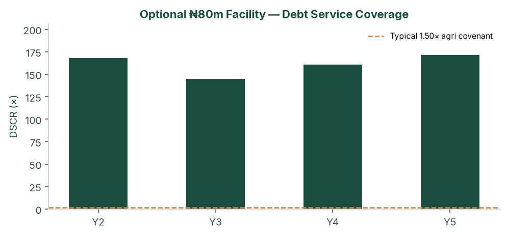

*Figure: Debt service coverage on the optional ₦80 million facility — planning case versus a typical 1.50× agricultural covenant.*

Security, if drawn: all-asset debenture; assignment of the master lease/option (negotiate now); charge over drip and packhouse; NAIC loss-payee; promoter guarantee; BOA lien deposit 10–20% if that product is used. Year 2 planning-case cash (₦998 million) would cash-collateralise the ticket after Cycle 2.

### 6.13 Cycle 1 cash waterfall (₦8.0 million pack)

Cash leaves the farm before Mile 12 pays. The ₦8.0 million pack is sized for that gap: ₦3.0 million CapEx and ₦5.0 million working capital. Cycle 1 lease cash in this pack is **cultivated hectare only** (₦100,000). The unused 99 ha is held on option/ROFR so a holding fee does not consume Cycle 1 working capital. Harvest cash (₦13.2 million at ₦33,000) returns over five to six weeks.

| Phase | Cash out (indicative) | Cash in | Running cash |
| --- | ---: | ---: | ---: |
| t = 0 — equity paid in | — | 8,000,000 | 8,000,000 |
| Headworks, 1 ha drip, crates, tools | 3,000,000 | — | 5,000,000 |
| Nursery, seed, first fertigation | 1,200,000 | — | 3,800,000 |
| In-season inputs, labour, IPM, water, lease, insurance | 3,200,000 | — | 600,000 |
| Harvest weeks (400 baskets @ ₦33,000) | 360,000 logistics | 13,200,000 | 13,440,000 |
| Cycle close (before 50/50) | — | — | ≈13.4m |

The ₦600,000 trough before first sale is why crates, fuel and the last labour week are not left to “pay from the market.” If Regular prints the stress floor (₦15,000) instead of ₦33,000, harvest cash is ₦6.0 million and Cycle 1 is a planned loss — the go/no-go below.

### 6.14 Cycle 1 go / no-go before the +2 ha Peak step

Cycle 1 is the proof. Do not add two hectares for Peak on hope.

| Cycle 1 result | Action |
| --- | --- |
| Yield ≥ 18 t/ha **and** average basket ≥ ₦30,000 | Proceed to 3 ha Peak as planned |
| Yield 15–18 t/ha **or** price ₦22,000–₦30,000 | Peak on 1–2 ha only; fix nursery, fertigation or grade; do not spend the full +2 ha drip until the next close |
| Yield < 15 t/ha **or** price ≤ ₦20,000 for the harvest | Stay at 1 ha; run Peak as a timing test; do not scale. That is the stress case, not a reason to raise opening capital |

---

## 7. Risk Assessment

The enterprise is high-margin, Peak-dependent and operationally constrained. It is not a thin row-crop that dies at a 10% price move. Residual high-impact items are execution: Peak timing, +45 ha mobilisation, tenure, and Cycle 1 cash coverage — all addressed in the pre-ops list.

### 7.1 Market risks

| Risk | L | I | Mitigation |
| --- | --- | --- | --- |
| Peak below ₦90,000 | M | H | Plan is ₦145k; stress ₦55k still Year-1-profitable; buffer |
| Regular glut ₦13–15k | M | M | Cycle 1 may lose money at the crash; do not size Year 1 debt off Regular |
| Self-cannibalisation at 72–100 ha | M | H | 70% bulk from C5 contracted, not hoped |
| Bulk buyer default | L | M | 40% concentration cap; 30% spot sleeve |
| New southern intensive entrants | L | M | 18-month relationship lead; capital wall |

### 7.2 Operational and tenure risks

| Risk | L | I | Mitigation |
| --- | --- | --- | --- |
| Missed Peak harvest window | M | H | Calendar reverse-engineered from Mile 12; farm-manager KPI |
| Staffing / +45 ha mobilisation | H | H | Hard ceiling; FarmPark (or successor) SLA before C4; option to delay add to next Peak |
| Irrigation failure | L | H | Spares; dual borehole from 15 ha |
| *Tuta* / Peak disease | M | H | IPM; lower Peak yield; NAIC |
| Lease defective / family claim | L | H | Counsel opinion; assignment language; holding fee + option |
| Water short at 100 ha | M | H | Pumping test sized to 100 ha before C5 |

### 7.3 Financial, tax, FX

Inflation 17% versus flat prices through Year 5 is the stress-case Year 5 5% EBIT path — keep facilities short or include a price reset. The agri holiday is upside only until a tax opinion exists; the planning case is fully taxed. Imported seed and drip FX is managed by early procurement and naira quotations.

### 7.4 Regulatory and legal

Legal vehicle, CAC and conversion to **SNLB Farms Limited** are in **§2.1**. A business name has unlimited personal liability. The master option/lease, FarmPark letter and any facility are signed by the limited company once the RC issues, or novated from the BN. TIN from Cycle 1. Pension Reform Act once management is employed. Master lease reviewed for renewal, sub-lease, lease-to-own and lender assignment. OGEPA screening on land use; escalate before packhouse.

### 7.5 Insurance (costed)

| Cover | Basis | Bind |
| --- | --- | --- |
| NAIC (or equivalent) arable / weather-index | 2% of production cost per cycle | Every cycle before transplant |
| Goods-in-transit | 1.5% of logistics | Every haul |
| Public / product liability + key person | ₦180,000 + ₦8,000/ha per cycle | Cycle 1 |
| Asset all-risks on drip, pumps, packhouse | Quoted at installation | At installation |

BOA publicly cites NAIC arable at 2% of material inputs — aligned with the model.

### 7.6 Overall

Structural margins in the planning case (EBIT 80–88%) and the 50% buffer are the safety cushion. Market-absorption risk at full scale is addressed via the Cycle 5 bulk transition. The binding constraint from Cycle 4 is operational bandwidth — which is why the 45 ha/cycle ceiling is part of the plan, not a later discovery.

---

## 8. Environmental, Social & Governance

### 8.1 Environmental

Drip reduces water per tonne versus flood or rain-fed waste. Short haul cuts embedded loss versus the northern corridor (40–50% typical). IPM aims to cut blanket insecticide versus high-pressure northern systems. Quantified water (m³/t) and pesticide (kg ai/ha) KPIs start Cycle 2.

IFC Performance Standards screening: OGEPA letter and a simple ESMP at 1–15 ha; labour terms and no child labour; spray buffers and haul hours; confirm the block is not wetland or forest reserve; chance-find procedure. Full ESIA is unlikely at 1 ha and likely at packhouse / 72 ha.

### 8.2 Social

Seasonal harvest employment scales with hectares; permanent staff follow the organogram. Skills transfer via the farm-management company. Prefer local labour for harvest. Pension Reform Act compliance for formal staff.

### 8.3 Governance

Cycle-level close, 50/50 rule, audit from Year 1, related-party lease disclosure, and a collection account if any facility is live. The board sits in **SNLB Farms Limited**: promoter plus one independent with agribusiness or audit experience from Cycle 3. Reserved matters: new debt above ₦10 million; related-party leases; change of 50/50; sale of the leasehold interest; offtake above 40% with a single counterparty.

---

## 9. Conclusion

### 9.1 Feasibility verdict

This study finds the venture **feasible**. Starting from one hectare and ₦8 million of paid-in capital, the Regular-first planning case reaches the full 100-hectare master block in six cycles — three years — without required external financing. It is underpinned by a structural tomato supply deficit, Ogun’s geographic advantage, a first harvest at a non-glut Regular Mile 12 price, Peak capture from Cycle 2, and a capital-allocation policy that funds growth from retained profit while holding a cash buffer.

The planning-case NPV at 18% is **₦5.78 billion** (five years, no terminal value). The stress case remains value-accretive at 18% (₦429 million). The upside case, if the agri tax holiday holds on the same crop path, is ₦8.79 billion at the same discount. Processing, export and a second 100 ha are outside this NPV.

What the plan depends on is already in the body: Peak into July–November; Cycle 1 harvest **February–April**; ₦8 million paid in before transplant; a bankable option/lease with Cycle 1 rent on the cultivated hectare only; 50/50 and the 45 ha/cycle ceiling; bulk offtake before the +45 ha Regular step; cycle-level books from harvest one; drip integrity. Those items are conditions of first planting and subsequent gates (Appendix B), not a separate to-do list.

### 9.2 Closing

The opportunity is a structural tomato deficit, a 1.5-hour corridor to the price-setting market, and a two-cycle calendar that turns national volatility into a P&L feature. The plan is a thoroughly costed path from one hectare to one hundred — provided the pace of land expansion is matched, cycle for cycle, by staffing, drip and offtake, which the numbers show will be the true limiting factor almost from the outset.

---

## 10. Appendices

### A. Glossary

| Term | Meaning |
| --- | --- |
| Regular season | Dec–Jun cycle; **planned** at a non-glut Mile 12 ticket (harvest Feb–Apr), not at the January crash |
| Peak / scarcity season | Jul–Nov cycle aligned with northern supply collapse |
| 50/50 rule | NPAT split: 50% cash buffer, 50% reinvestment |
| Master block | Contiguous 100 ha under option/lease |
| BN | CAC business name — **SNLB ENTERPRISE**, no. **6922259** |
| Ltd | Private company limited by shares — **SNLB Farms Limited** (proposed; RC after filing) |
| Planning case | Regular first at non-glut ₦33,000 / Peak ₦145,000, agronomic yields, full tax |
| Upside case | Agronomic yields, observed Peak prints, agri tax holiday |
| Stress case | Glut Regular, weaker Peak, lower yield, faster inflation |
| DSCR | EBITDA / (interest + fees + principal) |
| NTA 2025 | Nigeria Tax Act 2025 |
| NAIC | Nigerian Agricultural Insurance Corporation (or equivalent) |
| BOA | Bank of Agriculture |
| ACGSF | Agricultural Credit Guarantee Scheme Fund |

### B. Conditions of first planting

1. **SNLB Farms Limited** incorporated (§2.1) — or BN 6922259 with a counsel novation note; TIN; company account; ₦8,000,000 paid in as share capital; share register and board minutes.
2. Executed master option/lease with lender-assignment language.
3. Independent soil test and borehole yield/quality on the first 10 ha.
4. Named farm manager (CV) and **FarmPark** (or successor FMC) **advisory letter for Cycle 1** — contracting company matched to CAC; no co-investment; no NPAT share (Appendix F).
5. NAIC and GIT bound for Cycle 1.
6. Seed and drip quotations.
7. Promoter KYC (NIN, BVN, ID, PEP).
8. Tax engagement letter (holiday versus 34%).
9. Cycle 1 budget signed against ≈₦6.3 million planning-case cash opex (Regular, 1 ha).

**Subsequent gates:** Cycle 1 Regular management accounts; Peak IPM before Cycle 2; two offtake LOIs before Cycle 3; mechanization SLA and 100 ha water note before Cycle 4; bulk term sheet before Cycle 5 (or delay +45 ha); Year 1 audit within 120 days.

### C. Data-room index

Corporate (BN 6922259 certificate, Ltd RC/MEMART/share register, TIN) · Land (lease/option, survey, counsel) · Technical (soil, water, drip, seed, IPM, calendar) · Market (price log, LOIs) · Financial (statements, cycle packs, tax, insurance) · ESG (OGEPA, labour) · Security (asset register) · Quotations · FMC (FarmPark CAC, advisory letter matching the tomato RACI, reference farms, fee quote).

### D. Model files

`snlb-farms/model/financial_model.py` · `outputs/model_results.json` · `credit_cycle_pnl.csv` · `credit_annual.csv` · `credit_debt_dscr.csv` · charts in `snlb-farms/charts/`. Cycle 1 opening uses are in §6.11 of this study.

### E. Primary sources & benchmarks

NIHORT production guidance and HortiTom4/5 notes. Olam-Caraway public yields. Mile 12 price points from Businessday, Nairametrics, Vanguard and related reporting, August 2024 – July 2026. NBS food inflation May 2026 (16.96% y/y). Nigeria Tax Act 2025 (small-company test; 30% CIT; 4% Development Levy; 5-year agri exemption for qualifying crop production — confirm with counsel). BOA production-loan charges (9%; NAIC arable 2%). ACGSF up to 75% guarantee. Industry estimates: 3.7 Mt output; 40–50% post-harvest loss; US$350–400m paste imports. Drip kit Nigerian retail ranges 2024–2026; model uses ₦1.0m/ha incremental plus shared headworks. **Cycle 1 ₦8m uses:** Veggie Concept/Veggie Grow 1-ha tomato plan (structure only); dripirrigation.com.ng ₦0.5–1.25m/ha laterals; Farmsquare 1-acre kits ₦450–600k; HTS Farms/FarmPays August 2026 seed and soluble tickets (NPK 50 kg ~₦70k; KNO₃ 25 kg ~₦85–87k); SW borehole ₦0.6–1.5m; farm crates ₦7.5–11.6k.

### F. FarmPark partner file — public facts and gaps

**Intended FMC:** FarmPark, King’s Deck, Alternative Route off Chevron Drive, Lekki.

| Public fact | Status |
| --- | --- |
| Office at Chevron / King’s Deck | Repeated on website, LinkedIn and 2021–22 job ads |
| Legal name | **Open.** Trademark said to sit in FarmAgro Projects Limited; job boards say FarmPark Limited. No RC number in public materials. |
| Years in market | Farm Administrator: established **2016**. LinkedIn: **2018**. Founder CV: FarmPark from **March 2017**. |
| Epe pilot farm + named manager | *The Sun* (Adikaibe): test site so “investors’ funds are properly managed.” LinkedIn: **Yisau Hammed**, Farm Manager at FarmPark **Epe** from Jul 2020. |
| Farmer counts they quote | ~250 poultry farmers; ~750 farmers in all — **management estimate**, not audited. Vegetable production and third-party farm management from **2018**. |
| Audited financials | **None found** (FarmPark / FarmPark Limited / FarmAgro Projects Limited). No filed P&L, tax clearance or tomato t/ha on letterhead. |
| How they operate | Land sale + co-investment + managed farm. FARM-IN / FARM-OUT / e-Farming. Place a farmer, schedule plant/harvest, irrigate, remit returns. Mixed **crop and poultry/fish**. Tomato only as “produce the investor desires.” Site tours before money moves. |
| Instagram / capital-at-work | @farmparkng behind login from this desk. Use their own visuals: Epe farm, site tours, weekly e-Farming pack. |
| Tomato / drip / Mile 12 SOP | **Not published.** No cultivar, no 20 t/ha, no Feb–Apr Regular window, no Mile 12 floor. |
| Risk method they preach | Diversify into **livestock** — conflicts with a tomato-only 100 ha block |
| Website claims (500 acres, 85% yield, $12.99 plans, foreign staff names) | Treat as **template / unverified**. Do not use in the model. Generic broiler “~30% ROI” in the *Sun* interview is **not** FarmPark’s tomato track record. |
| Headcount | Public scrapes 1–11 people. Insufficient on its face for 72–100 ha without named subcontractors. |
| Related party signal | 2022 jobs directed CVs to a **Revelation Properties** Gmail. Ilara, Epe “Farm Park” land listings are a **land product**, not a farm P&L. |
| SNLB counterparty | **SNLB ENTERPRISE** BN 6922259 on file; **SNLB Farms Limited** is the contracting party once the RC issues (§2.1) |

**Gaps the promoters must close before paying a retainer or treating the FMC CP as met**

1. CAC extract: contracting company, RC, directors, who signs.
2. Written **advisory** mandate for Cycles 1–2 — no co-investment, no FarmPark land, no NPAT share.
3. Three reference farms (crop, hectares, yield, buyer) and a visit to one working site.
4. Named Ogun farm manager (CV) who accepts the §4.13 KPI pack.
5. Naira fee quote; disclosure of any input mark-up.
6. Mobilisation note for +15 / +27 / +45 ha and a Cycle 4 mechanization SLA.
7. Related-party and non-circumvention letter on the 100 ha option.
8. NAIC/GIT and labour (whose payroll) in writing.

Walk away if they will only transact as an unnamed “FarmPark,” insist on co-investment or a profit share, or cannot show a farm you can walk.

**Cycle map (if they pass DD)**

| Cycle | SNLB tomato job | FarmPark role |
| --- | --- | --- |
| Pre-ops | Lease, soil, water, ₦8m, seed/drip | Advisory letter; drip/nursery spec; not the land vendor |
| C1 Regular, 1 ha | 20 t/ha; Feb–Apr; Mile 12 | Advise calendar, fertigation, labour gang; ₦150k retainer |
| C2 Peak, 3 ha | 18 t/ha; Jul–Nov | Peak IPM; +2 ha drip supervise; go/no-go after C1 |
| C3–C4 | 15 → 27 ha; mechanization | Optional SLA; tractor coordination |
| C5–C6 | 72 → 100 ha | Master service only if C4 mobilisation was real |

**First-meeting ask:** CAC entity and who signs; Ogun farm-manager CV; three reference farms plus a **visit to the Epe pilot**; last twelve months of **@farmparkng** (or equivalent) showing kit on a farm, not only land flyers; Cycle 1 advisory letter (no equity farm-out); naira fee; no co-investment / no land / no NPAT share / no livestock on the block; related-party disclosure (Revelation Properties).

### G. Document control

| Version | Date | Notes |
| --- | --- | --- |
| Comprehensive Feasibility Study | August 2026 | §2.1 incorporated vehicle: SNLB ENTERPRISE BN 6922259 and proposed SNLB Farms Limited; Cycle 1 ₦8m uses; FarmPark advisory |

Prepared for SNLB Farms. Not for general circulation. Replace planning tables with live quotations and the site report before any binding credit application.
