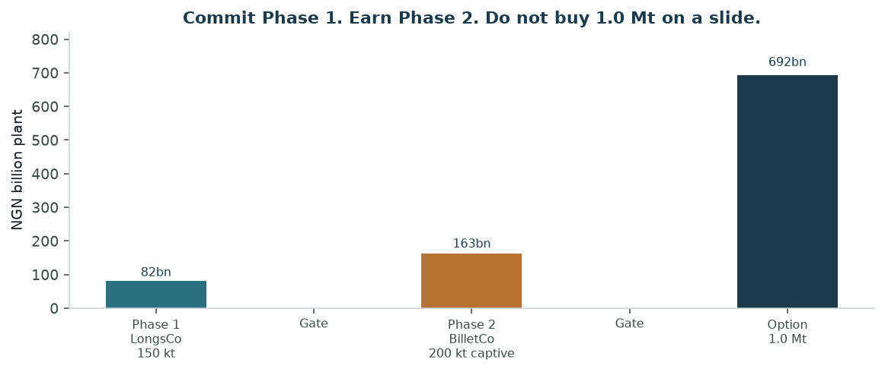
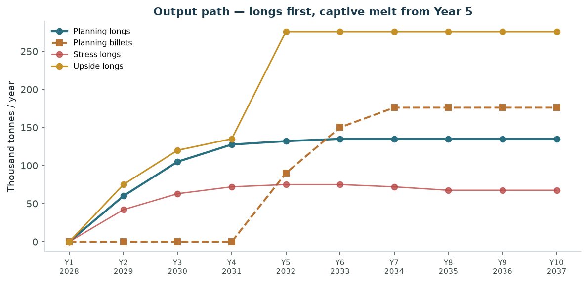
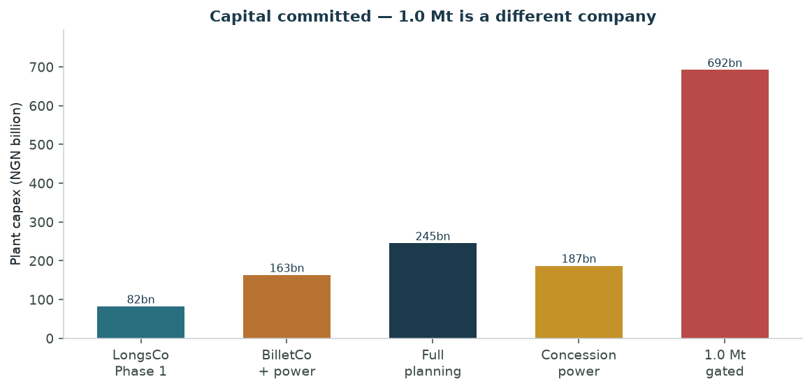
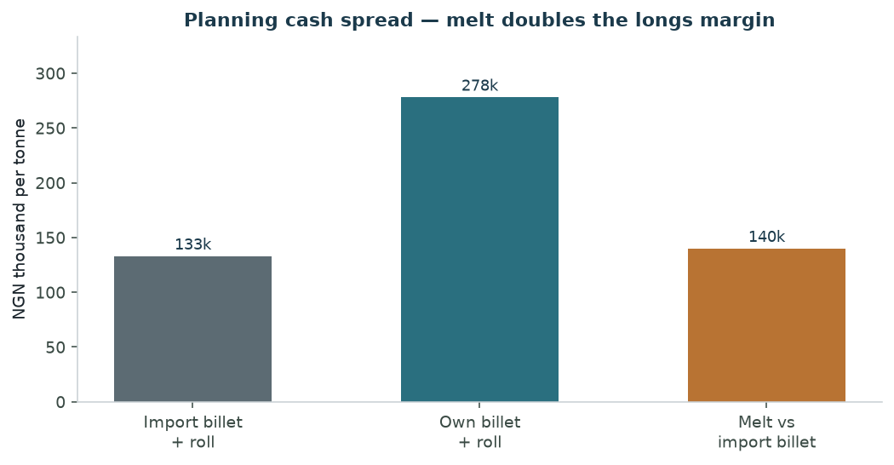
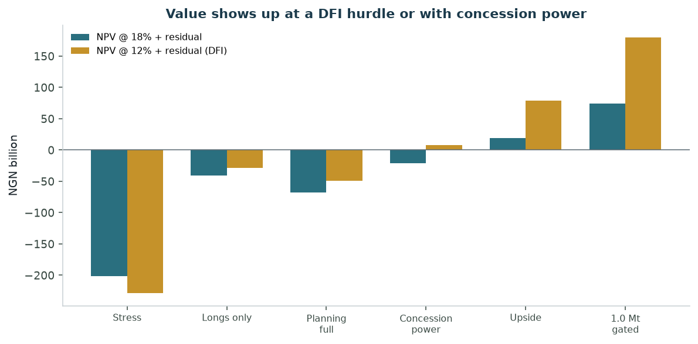
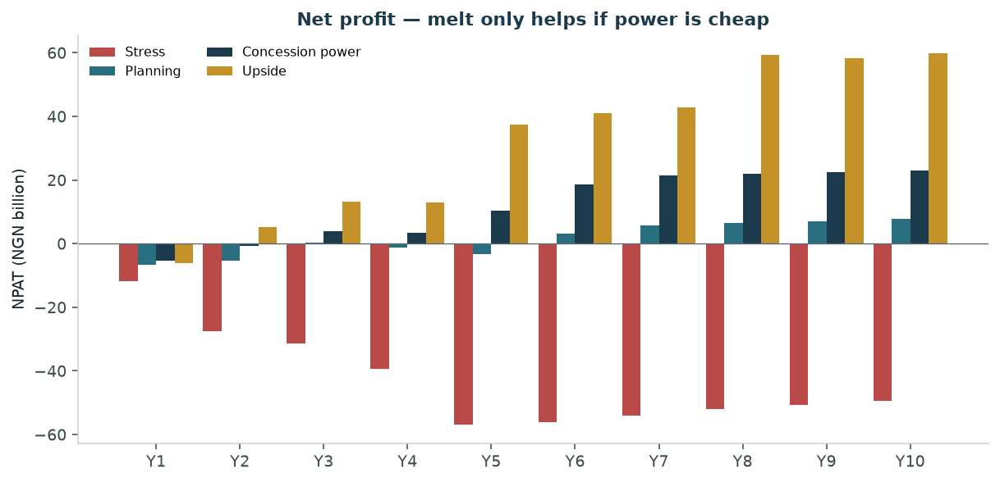
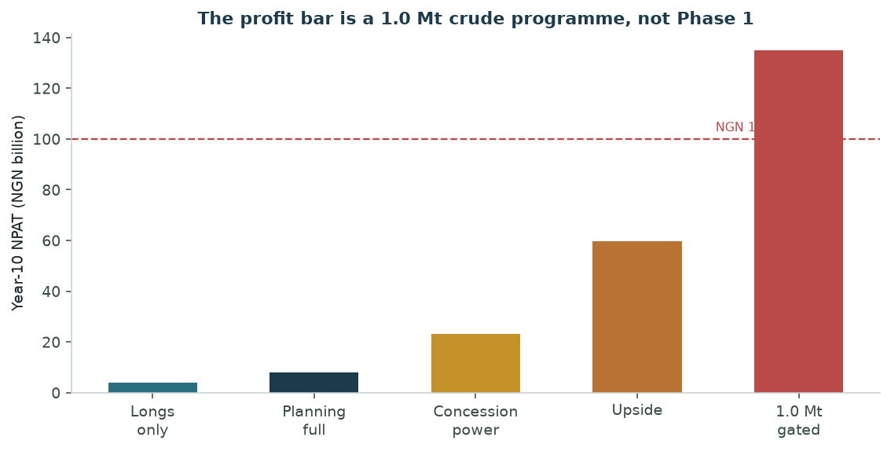

# Ashlar Steel
# Billet and Semi-Finished Steel — Nigeria Plan and Cost–Benefit Analysis

**Prepared:** September 2026 · **v1.0**  
**Horizon:** 10 years (2028–2037) · planning FX **₦1,500 / USD**  
**Vehicles:** Ashlar Steel Holdings → **Ashlar Longs Ltd** and **Ashlar Billets Ltd**  
**Classification:** Planning document — not financial, legal, tax or investment advice.

This plan is independent. It does not rely on kiosks, termini, or any other business. Two companies, one holding, one industrial corridor.

---

## 1. Verdict

Nigeria still buys most of its steel abroad. Official iron-and-steel imports passed **₦1 trillion** in 2025 (NBS). The Steel Ministry’s wider estimate, including under-recorded cargo, is about **$4 billion (~₦5.6 trillion)** a year. Domestic crude output was about **1.2 million tonnes** in 2025 against a government ambition of **10 million tonnes** by 2030. Construction still pays around **₦0.95–1.10 million per tonne** for TMT rod.

That is a real industrial gap. It is not an empty field. African Foundries already runs a large longs complex. Premium Steel has a **$1.3 billion** brief to revive Delta Steel. A **$450 million** Ogun plant is in the announced queue. About **$2.7 billion** of private steel commitments are on the table. This plan does **not** bid Ajaokuta or Delta Steel. It builds a **private** pair of companies on the Ogun industrial belt: roll first, melt second.

| Question | Planning answer |
| --- | --- |
| Is the *shape* right? | **Yes.** B2B staple, heavy product, factories and sites that already buy every month. |
| Two companies? | **Yes.** LongsCo rolls. BilletCo melts. Holdings owns both. |
| Opening commitment? | **Phase 1 only:** 150 kt/year rolling mill. Plant **₦82 billion**. Equity **₦28.7 billion**. DFI/bank **₦53.3 billion** at 9%. |
| Phase 2? | **200 kt captive EAF + caster + ~40 MW gas.** Plant **₦163 billion**. FID only after gates. |
| Full planning plant? | **₦245 billion** over five years. Equity **₦85.8 billion**. Debt **₦159 billion**. |
| Planning Year-10 run-rate? | **₦159 billion** sales · **₦33 billion** EBITDA · **₦7.9 billion** NPAT. |
| Does Phase 1+2 clear 18%? | **No.** NPV @ 18% with residual **−₦68 billion**. Unlevered IRR with residual **5.3%**. |
| When does it clear? | **Concession gas/power** at a **12% DFI** hurdle: NPV **+₦7.6 billion**, IRR **13.2%**. Fat-traffic upside at 18%: **+₦19 billion**. |
| ₦100 billion **profit**? | **Not on this opening plan.** Year-10 planning NPAT is **₦8 billion**. Concession **₦23 billion**. Upside **₦60 billion**. A gated **1.0 Mt** crude programme prints **₦135 billion** NPAT — different capital (**₦692 billion** plant). |
| ₦100 billion **sales**? | **Yes**, from Year 3 on the longs mill alone (~₦104–134 billion). |



*Figure: Capital committed now is the 150 kt longs mill. The melt shop is a second FID. One million tonnes is an option, not a purchase order.*

**Go / no-go**

| Decision | Call |
| --- | --- |
| Incorporate Holdings + LongsCo, raise Phase 1 | **Go** if ≥50% of 150 kt is pre-sold and a gas/reheat term sheet exists. |
| Build BilletCo | **Go after gates.** Longs ≥70% utilised for 12 months, 10-year gas SPA, scrap + DRI cover ≥70% of the charge. |
| Size BilletCo to export billets | **No.** Billets can enter at **0% duty**. Melt is for **captive** feed to LongsCo. |
| Sprint to 1.0 Mt / ₦100bn NPAT | **No.** That is a later programme with its own offtake and power. |
| Stress (no power, dumped rod, 45% util) | **Do not build.** EBITDA stays negative. |

---

## 2. Two companies

The user asked for a **billet company** and a **semi-finished / longs company**. They are not one plant with two labels. They have different customers, different tariff walls, and different capital.

| | **Ashlar Longs Ltd** | **Ashlar Billets Ltd** |
| --- | --- | --- |
| Job | Roll billets into **TMT rebar, wire rod, merchant bar** | Melt scrap + DRI in an **EAF**, cast **billets** |
| Customer | Distributors, fabricators, construction majors, ECOWAS yards | **LongsCo first.** A thin surplus to other rollers only |
| Tariff wall | Finished deformed bars / 5.5–14 mm rods: about **35%** (2026 FPM, down from 45%) | Billets / HRC for local production can qualify for **0%** |
| Why it exists | Beat **duty-paid landed rod**, not China FOB | Take **₦140,000/t** off LongsCo’s metal bill if power is cheap |
| Opening scale | **150,000 t/year** nameplate | **200,000 t/year** nameplate — sized to the mill, not to Africa |
| Plant | **₦82 billion** | **₦125 billion** melt + **₦38 billion** captive gas (~40 MW) |
| When | Years 1–2 | Years 4–5, after LongsCo prints |

**Ashlar Steel Holdings** owns 100% of both. Consolidation kills inter-company billet sales. Statutory books still show a transfer price (import-parity minus a thin discount) so VAT and related-party rules stay clean.

Do not add a third company for “slabs and coils” in Phase 1. Flats (HRC, CRC, coated sheet) are a different mill, a different offtake, and a fight with imported coil. This plan is **longs**.

---

## 3. Market and policy

**Demand.** Industry and ministry figures put Nigerian steel use near **7–10 million tonnes** a year, with something like **70% imported**. Rebar is the everyday tonne: housing, roads, power plants, telecom towers. Wire rod feeds nail, mesh, and electrode shops. Merchant bar feeds fabricators. Those three SKUs are what LongsCo sells.

Retail rod in early 2026 sat near **₦950,000–₦1.10 million per tonne** for common TMT sizes (market surveys). Planning uses a blended ex-mill **₦990,000/t** — below the retail print, in the band a mill actually invoices a distributor.

**Official vs ministry import bills.** NBS recorded **over ₦1 trillion** of iron and steel imports in 2025 (six-year official average ~₦526 billion). The Minister of Steel has used **~$4 billion / ~₦5.6 trillion**, which includes cargo the customs file misses. This CBA uses the **NBS floor** for humility and the **$4 billion** figure only as the ceiling on national substitution.

**Policy.** The 2026 Fiscal Policy Measures (from 1 April 2026) cut some steel lines and still protect finished longs:

- Zinc-coated sheet, aluminium-coated coil, electrolytically plated steel, **deformed hot-rolled bars**, **rods 5.5–14 mm**: **35%** (from 45%).
- Cold-rolled low-carbon: about **15–20%** depending on line.
- **Billets and HRC used for local production** can qualify for **0%**.

That is the whole strategy in one table. The state wants you to **process** semis here. It does **not** give you a wall against imported billets. A company that only melts and sells billets competes with Ukraine, Russia and China at world price plus freight. A company that rolls **and** melts uses the 35% wall on the product people pour into concrete.

IATs on many lines begin to fade from 2027 toward zero by 2036 under ECOWAS/AfCFTA. The 35% finished-longs protection is **not a permanent moat**. Phase 1 must still work if the wall thins. That is why Phase 2 exists — own metal, not own tariff.

**Who is already here**

| Player | Role versus this plan |
| --- | --- |
| African Foundries / ASHL | Largest working longs complex; ~$450m revenue; captive power; DRI + scrap. The incumbent to respect, not to clone in Year 1. |
| Premium Steel / Delta Steel | $1.3bn revival, 1 Mt liquid steel, Itakpe ore. State process. **Do not bid it.** |
| Announced Ogun Chinese plant (~$450m) | Same corridor. Race on execution and offtake, not on press releases. |
| Dana, KAM, Landcraft, Lagos/Ogun rollers | Many import billets and roll. LongsCo’s first customers *and* first competitors. |
| Ajaokuta | 20-year gas MoU in 2026; still not a commercial mill. Leave it. |

West Africa is a **warehouse and distributor** market for Phase 1 (Ghana, Benin, Cameroon, Chad construction). It is not a second mill until the Ogun plant is full.

---

## 4. Technical plan

**Site.** Ogun industrial corridor (Ogijo–Sagamu–Ibafo / Agbara class): Lagos construction demand, Apapa/Lekki billets and scrap, gas laterals, trucking to the hinterland. Not Kogi (ore without a finished-goods market on the doorstep). Not a Jibowu-style inner plot.

**Phase 1 — LongsCo**

- 150 kt/year continuous bar mill, TMT quenching, cooling bed, finishing, SON lab.
- Mix: **70% rebar, 20% wire rod, 10% merchant bar**.
- Reheating on **contracted gas**, not diesel. 10–15 MW of site power (grid + gas genset). The EAF is not in this phase.
- Billet yard sized for 50 days of metal. Imported 130–160 mm billets until BilletCo starts.
- Quality: BS 4449 / equivalent TMT, full certificates. The market’s silent tax is **underweight bar**. SON-grade rod is the brand.

**Phase 2 — BilletCo (captive)**

- 200 kt/year EAF + ladle furnace + 3-strand continuous caster.
- Charge: about **60% scrap / 40% DRI** (planning). Scrap from Lagos/Ogun yards; DRI on a multi-year offtake (do not build a DRI plant in Phase 2).
- **~40 MW captive gas** (or an IPP at the fence). This is the gate. Diesel melt is the stress case.
- Output: 6 m and 12 m billets to LongsCo. Surplus only if another roller has signed.

**What is not in the plan**

- Iron-ore mine, pellet plant, or blast furnace.
- HRC / CRC / coated flats.
- A mill in every state or a “serve 54 countries” map.
- Buying Ajaokuta, DSC, or NIOMCO.

**Sequence**

1. Offtake and gas for LongsCo.  
2. Build and run the 150 kt mill on imported billets.  
3. Twelve clean months at ≥70% utilisation.  
4. FID on BilletCo.  
5. Only then talk about a second stand or 1.0 Mt.



*Figure: Planning longs ramp from Year 2. Melt starts in Year 5 and is sized to feed the mill. Upside adds a second stand; stress never fills the plant.*

---

## 5. Cost

Planning FX **₦1,500 / USD**. Plant items are imported; this rate is a capital-goods assumption, not a CBN spot call.

### 5.1 Uses — Phase 1 (LongsCo)

| Item | ₦ billion | $ million |
| --- | --- | --- |
| Bar mill, TMT line, electrics (~$165/t × 150 kt, plus extras) | 37 | 25 |
| Civil, cranes, yard, lab, offices | 18 | 12 |
| Reheat, utilities, 10–15 MW site power | 15 | 10 |
| Engineering, spares, commissioning, owners | 12 | 8 |
| **Plant** | **82** | **55** |
| Opening metal + receivables (inside the ten-year WC path) | ~16–20 once running | 11–13 |
| **Phase 1 equity** | **28.7** | **19** |
| **Phase 1 debt (9% DFI/bank, 10-year amort from Y3)** | **53.3** | **36** |

A 30–100 t/day “mini mill” at ₦0.5–1.2 billion is a different animal. It cannot hold SON-grade share against AFL. This plan is a **real** 150 kt mill.

### 5.2 Uses — Phase 2 (BilletCo + power)

| Item | ₦ billion | $ million |
| --- | --- | --- |
| EAF + LF + caster, 200 kt | 125 | 83 |
| Captive / dedicated gas, ~40 MW | 38 | 25 |
| **Phase 2 plant** | **163** | **109** |
| Equity (35%) | 57.1 | 38 |
| Debt (10%, 12-year amort from Y6) | 106.0 | 71 |

Full planning plant **₦245 billion**. Equity **₦85.8 billion**. Debt **₦159.3 billion**.



*Figure: Phase 2 is twice Phase 1. The 1.0 Mt option is almost three times the full planning plant.*

### 5.3 Unit cash cost (planning, per tonne)

| Line | ₦ / t |
| --- | --- |
| Landed imported billet (0% duty, planning) | 750,000 |
| Own billet cash cost (scrap/DRI + power + electrodes) | 610,000 |
| Rolling conversion (gas, rolls, labour, power) | 80,000 |
| Yield (1.036 t billet / t finished) | — |
| **Spread, import route** (ASP ₦990,000) | **133,000** |
| **Spread, own-billet route** | **278,000** |
| **Melt versus import billet** | **140,000** |



*Figure: Rolling imported billets is a thin spread. Captive melt more than doubles it — if the kWh price is real.*

Billets are **70–85%** of a roller’s cash cost worldwide. If BilletCo’s own cost is not below import-parity, Phase 2 is a monument.

### 5.4 Operating burden (planning)

- Holdings + two-company G&A: **₦2.8 billion** in Year 1, +7% a year.
- Insurance: **0.8%** of cumulative plant.
- Tax: **32.1%** on positive PBT (30% CIT + education tax, stacked). Pioneer status is **not** in the planning case.
- Metal working capital: **50 days**. Receivables: **25 days**.

### 5.5 Stress cost

Diesel melt, ₦800,000 imported billets, ₦140,000 conversion, ₦820,000 rod price, utilisation stuck near 45%. That is the failed-Kano-textile pattern in steel: new equipment on expensive power. The model keeps EBITDA **negative** every year.

---

## 6. Benefit

### 6.1 Private — planning ten-year P&L (consolidated)

| Year | Longs kt | Billets kt | Revenue | EBITDA | NPAT | Plant capex | Project FCF |
| --- | --- | --- | --- | --- | --- | --- | --- |
| Y1 2028 | — | — | — | −₦3.3bn | −₦6.6bn | ₦57.4bn | −₦60.7bn |
| Y2 2029 | 60 | — | ₦59.4bn | ₦4.1bn | −₦5.3bn | ₦24.6bn | −₦31.0bn |
| Y3 2030 | 105 | — | ₦104.0bn | ₦9.7bn | ₦0.2bn | — | ₦0.2bn |
| Y4 2031 | 128 | — | ₦126.2bn | ₦11.8bn | −₦1.3bn | ₦65.2bn | −₦59.6bn |
| Y5 2032 | 132 | 90 | ₦130.7bn | ₦24.0bn | −₦3.3bn | ₦97.8bn | −₦76.3bn |
| Y6 2033 | 135 | 150 | ₦140.8bn | ₦32.1bn | ₦3.1bn | — | ₦25.1bn |
| Y7 2034 | 135 | 176 | ₦159.3bn | ₦34.4bn | ₦5.6bn | — | ₦24.1bn |
| Y8 2035 | 135 | 176 | ₦159.3bn | ₦34.1bn | ₦6.4bn | — | ₦27.4bn |
| Y9 2036 | 135 | 176 | ₦159.3bn | ₦33.7bn | ₦7.1bn | — | ₦27.1bn |
| Y10 2037 | 135 | 176 | ₦159.3bn | ₦33.4bn | ₦7.9bn | — | ₦26.9bn |

Year 4–5 NPAT dips because melt debt is drawn **before** melt tonnes. That is why Phase 2 is a second FID, not a single close.

Ten-year cumulative NPAT, planning: **+₦13.8 billion**. Residual plant book + working capital at Y10: **₦178 billion** (the mill is not scrap in year 10).

### 6.2 Private — NPV and IRR

Assets last 16–20 years. A ten-year cut without residual understates value. The table shows both.

| Case | Plant | Y10 NPAT | IRR unlev. | IRR + residual | NPV @ 18% + resid. | NPV @ 12% + resid. |
| --- | --- | --- | --- | --- | --- | --- |
| Stress | ₦251bn | −₦49bn | n/m | −18% | **−₦202bn** | −₦229bn |
| Longs only | ₦82bn | ₦3.8bn | −6% | 4.8% | −₦41bn | −₦29bn |
| **Planning full** | **₦245bn** | **₦7.9bn** | −11% | **5.3%** | **−₦68bn** | −₦50bn |
| Concession power | ₦187bn | ₦23bn | 3.3% | **13.2%** | −₦21bn | **+₦7.6bn** |
| Upside | ₦395bn | ₦60bn | 7.8% | **21%** | **+₦19bn** | +₦79bn |
| 1.0 Mt gated (upside ops) | ₦692bn | **₦135bn** | — | **27%** | **+₦74bn** | — |



*Figure: At a private 18% hurdle the planning plant destroys value. At a 12% DFI hurdle, concession power clears. Upside and 1.0 Mt are not the opening case.*

**Read this correctly.** Rolling imported billets at a ₦133,000/t spread does **not** earn Nigerian private-equity rates. The public case for DFI money is **import substitution + jobs + SON-grade rod**, not 25% IRR. Holdings should raise Phase 1 as a **BOI / Afrexim / local-bank** project, not as a 22% cash-business.

Longs-only is cheaper and still does not clear 18%. Full planning spends ₦163 billion more to buy the melt spread; without cheap power that extra capital **widens** the NPV hole (−₦68bn vs −₦41bn). Melt is valuable **only** when own billet cash cost stays near **₦610,000/t or below**.

### 6.3 Public benefit (planning)

| Public line | Planning |
| --- | --- |
| Finished + merchant tonnes substituted over 10 years (revenue proxy) | **₦1.20 trillion** |
| Year-10 annual substitution | **₦159 billion** (~$106 million) |
| Substitution per naira of plant | **4.9×** |
| Direct jobs (planning full) | ~350 LongsCo + ~400 BilletCo + power |
| Indirect (scrap, trucks, fabrication) | ~2,000–4,000 |
| Quality | Certified TMT versus underweight market bar |

Concession power: **₦1.24 trillion** substituted on **₦187 billion** plant (**6.6×**).

These public numbers are **gross substitution**, not a social NPV. They are why a DFI can fund a project whose private NPV at 18% is negative.

### 6.4 Who keeps the private benefit

| Party | Take |
| --- | --- |
| Holdings | Residual equity after debt; LongsCo cash from Year 3; BilletCo cash from Year 6 |
| DFI / banks | 9–10% on amortising project debt; DSCR in planning rises above **1.25×** only once melt is running (Y5+) |
| Host state (Ogun) | PAYE, land, power offtake politics |
| Distributors | Margin on certified rod |
| Scrap / DRI suppliers | A monthly industrial offtake |

---

## 7. Scenarios



*Figure: Stress never makes money. Planning is thin. Concession power is the first case with a serious profit line. Upside is fat traffic and a second stand.*

**Stress.** Rod ₦820,000/t, imported billet ₦800,000, conversion ₦140,000, no captive power, utilisation ~45%. The mill is a diesel monument. Do not “hope utilisation up.” Kill the project if Year-2 traffic looks like this.

**Planning.** The feasibility case in this memo. Imported billets until Year 5. Captive melt at ₦610,000/t. 90% longs utilisation from Year 6. Honest, not heroic.

**Concession power.** Same volumes, cheaper plant (shared park civils, IPP at the fence), own billet **₦540,000/t**. This is the **go-shape** for Phase 2: gas SPA and site deal written like a Dangote-style input contract, not “we will find megawatts.”

**Upside.** Second 150 kt stand in Year 5, merchant melt in Year 8, ₦1.08 million/t ASP, ₦560,000 own metal. Year-10 NPAT **₦60 billion**. Still not ₦100 billion.

**1.0 Mt gated.** Upside operations plus a later crude expansion to **one million tonnes**. Plant **₦692 billion**. Year-10 NPAT **₦135 billion**. IRR with residual **27%**. This is the only case in the model that **clears ₦100 billion profit**. It is an option after the first mill is fat, not the raise.

---

## 8. Funding

**Phase 1 close (now)**

1. **₦28.7 billion equity** — promoters, industrial partners, maybe a strategic longs distributor.  
2. **₦53.3 billion** BOI / Afrexim / local club at **9%**, machines and assignment of offtake as security, 10-year amort from Year 3.  
3. No ₦160 billion ticket. No ₦90 billion “steel fund” on a slide.

**Phase 2 close (after gates)**

1. **₦57 billion** new equity (retained Phase 1 cash will not be enough; Holdings raises).  
2. **₦106 billion** project finance at **10%**, 12 years from Year 6, gas SPA in the security package.

**What the debt can stand**

Planning DSCR is below 1.0× in the build years (no sales) and about **0.96×** in Year 3. It is not a comfortable coverage until melt tonnes arrive. Size the first facility to **LongsCo only**. A single loan for ₦245 billion on day one does not service — the same mistake as a giant ticket on an unbuilt kiosk fleet.

Pioneer tax holiday would fatten NPAT. It is **not** in the model. Treat it as upside if NIPC grants it.

---

## 9. Gates

Write these into the shareholders’ agreement.

**Before LongsCo notice to proceed**

1. **≥50% of 150 kt** under offtake (12-month rolling, named distributors or EPCs).  
2. Gas or dual-fuel reheat contract. Diesel-only is a no-go.  
3. Site with truck access to Lagos and the hinterland; not an inner-city plot.  
4. SON / MANCAP path and a lab specification in the EPC.  
5. Billet supply: two seaborne sources, 0% industrial-input documentation.

**Before BilletCo FID**

1. LongsCo **≥70% utilised for 12 months**.  
2. **10-year gas SPA** (or IPP PPA) at a price that keeps own billet ≤ **₦610,000/t** in today’s naira.  
3. Scrap + DRI cover **≥70%** of the charge, take-or-pay or equivalent.  
4. Combined DSCR path ≥ **1.25×** in the bank model after commissioning.  
5. No merchant billet expansion without third-party offtake.

**Never**

- A melt shop that sells most of its tonnes as billets into a 0% duty import market.  
- A copy of this mill in every geopolitical zone.  
- Using “₦100 billion profit” as the Phase 1 raise story.

---

## 10. The ₦100 billion question



*Figure: Planning, concession, and even the fat upside sit under the line. Only the gated 1.0 Mt crude programme crosses it.*

| If ₦100 billion means… | On this plan |
| --- | --- |
| Year-1 profit | No. |
| Year-10 planning profit | No. **₦8 billion.** |
| Concession-power profit | No. **₦23 billion.** |
| Upside profit (second stand) | No. **₦60 billion.** |
| Year-10 **sales** | **Yes** from Year 3 on LongsCo (~₦104 billion+). |
| Profit on a **1.0 Mt** crude + longs group | **Yes, ₦135 billion** — on upside ops and **₦692 billion** of plant. |
| One opening loan of ₦100 billion | No. Phase 1 is ₦53 billion of debt. |

Steel **can** be a ₦100 billion-profit industry in Nigeria. African Foundries’ recent ~$450 million revenue at compressed mid-single-digit to high-single-digit EBITDA is the live proof of scale **without** that profit. You get ₦100 billion NPAT by owning **melt and power at about a million tonnes**, not by rolling 150 kt of imported billets.

The independent plan is: **build the 150 kt mill that can exist; earn the captive melt; keep 1.0 Mt as a gated option.** That is how you get *onto* the path without betting the firm on a slide.

---

## 11. Risks

| Risk | Why it matters | Mitigation |
| --- | --- | --- |
| **Power / gas** | Stress case. Own billet jumps to ₦780,000/t. Melt destroys value. | SPA before FID. No diesel EAF. |
| **China / India dump + leaky 35%** | Spread on import-route longs is only ₦133,000/t. A ₦100,000 price cut wipes it. | Certified TMT, offtake, then captive melt. |
| **0% billet duty** | Standalone BilletCo has no wall. | Do not build a merchant billet shop. |
| **FX on plant and electrodes** | Capex and melt cash cost move with the naira. | Dollar-linked offtake where possible; conservative ₦1,500 planning FX. |
| **Scrap inflation** | AFL’s EBITDA already fell to **8.8%** when scrap and landed billets jumped. | DRI offtake, long scrap contracts, do not assume 2023 margins. |
| **Incumbents + new $2.7bn** | Same corridor, same customers. | Pre-sold tonnes. Do not assume empty demand. |
| **Tariff fade to 2036** | IAT liberalisation. | Competitiveness must be cost, not the 2026 FPM. |
| **Working capital** | Metal is most of the balance sheet. | 50-day discipline; no “fill the yard.” |
| **Quality / underweight bar** | Cheap illegal rod sets a fake price. | Lab, certificates, refuse to match underweight. |
| **Policy and host risk** | Steel has a 40-year graveyard of MoUs. | Private site, private offtake, no Ajaokuta bid. |

---

## 12. Implementation

| Window | Action | Owner |
| --- | --- | --- |
| Months 0–3 | Holdings + LongsCo; site option; offtake term sheets; gas/reheat enquiry | Promoter |
| Months 3–6 | Bankable DPR; EPC shortlist; Phase 1 term sheet (₦28.7bn equity / ₦53.3bn debt) | Promoter + advisor |
| Months 6–9 | Close Phase 1 only if gates 1–5 are green | Board |
| Months 9–24 | Build 150 kt mill | EPC |
| Year 2–3 | Commission; hit ≥70% util; SON listing | LongsCo |
| Year 3+ | BilletCo DPR; gas SPA; scrap/DRI | Holdings |
| Year 4–5 | Build melt + power only after FID gates | BilletCo |
| Year 6+ | Captive feed; DSCR ≥ 1.25× | Group |
| Later | Second stand / 1.0 Mt only with offtake | Board |

**Jobs at Phase 1:** order of 300–400 direct. **At Phase 2:** about 700–800 direct plus contractors.

---

## 13. What this plan is not

It is not Ajaokuta. It is not a $1.3 billion Delta Steel concession. It is not a textile mill, a kiosk fleet, or a “piece of everything.” It is not a promise that modern equipment alone beats dumped rod. It is a **two-company longs-and-captive-billet programme** whose opening cheque is **₦82 billion of plant** and whose honest planning profit is **single-digit billions** until power is cheap and the mill is full.

If the bar is **₦100 billion NPAT**, the document’s answer is: **same industry, later scale (≈1.0 Mt crude), different raise.** If the bar is **a real steel company that can get onto that path**, Phase 1 is the plan.

---

## 14. Model notes and sources

**Rebuild**

```bash
python3 model/cba_model.py
python3 model/generate_charts.py
python3 model/build_pdf.py
```

Planning FX ₦1,500/USD. Tax 32.1%. Discount 18% private / 12% DFI sensitivity. Residual at Year 10 = remaining book value + working capital. Yield 1.036 t billet per t finished. Bar-mill capex benchmark ~$165/t (global bar-mill samples). Melt all-in ~$415/t equipment plus a separate power line. Unit prices anchored to 2026 Nigerian rod surveys (~₦0.95–1.10m/t retail) and a $450–500/t class landed billet.

**Sources (public, 2025–2026)**

- NBS iron-and-steel import values as reported by Punch / Nation (2025 bill **>₦1 trillion**; six-year official average ~₦526 billion).  
- Ministry of Steel: ~**$4 billion** import estimate; ~**10 Mt** demand; ~**70%** imported; **1.2 Mt** crude in 2025 (World Steel via BusinessDay); 10 Mt ambition by 2030.  
- 2026 Fiscal Policy Measures (1 April 2026): finished longs lines at **35%**; industrial billets/HRC can qualify for **0%**.  
- African Foundries: ~**$450 million** revenue; EBITDA **8.8%** after scrap/billet inflation (from 17.9% in 2023); 500 kt DRI input layer; captive power.  
- Premium Steel / Delta Steel: **$1.3 billion**, 1 Mt liquid, NIOMCO Itakpe offtake.  
- Private commitments ~**$2.72 billion** including a **$450 million** Ogun plant (BusinessDay).  
- Ajaokuta: 20-year gas GSA, 3 MMscf/d firm + 47 MMscf/d interruptible (2026); still not commercial.  
- Rebar retail: NaijaSabi / Buildpadi / Bizwatch surveys, early 2026.  
- Global conversion: Steelonthenet bar-mill capex and rebar cost stack (billet ~70–85% of cash cost; rolling value-add often $80–150/t).

**Working names.** Ashlar Steel Holdings, Ashlar Longs Ltd, and Ashlar Billets Ltd are labels for the vehicles. Register what counsel files.

---

## 15. One-page cost–benefit

| | Cost | Benefit if gates pass |
| --- | --- | --- |
| **Phase 1 LongsCo** | ₦82bn plant · ₦28.7bn equity · ₦53.3bn debt | 150 kt certified longs · ~₦134bn sales at 90% · ~₦3.8bn NPAT longs-only · first industrial books |
| **Phase 2 BilletCo** | ₦163bn plant · ₦57bn equity · ₦106bn debt | Captive metal · planning group ~₦159bn sales · ~₦8bn NPAT · ₦140k/t off the metal bill |
| **Concession power** | ₦187bn plant (cheaper civils + IPP) | ~₦23bn Y10 NPAT · IRR 13% with residual · NPV +₦7.6bn @ 12% |
| **Stress** | ~₦251bn wasted | None. Do not build. |
| **1.0 Mt option** | ₦692bn plant | ~₦135bn Y10 NPAT — only after the first mill is fat |

**Holdings recommendation.** Raise and build **LongsCo**. Write BilletCo as a gated second company. Treat ₦100 billion profit as the **1.0 Mt** question, not the opening prospectus.
